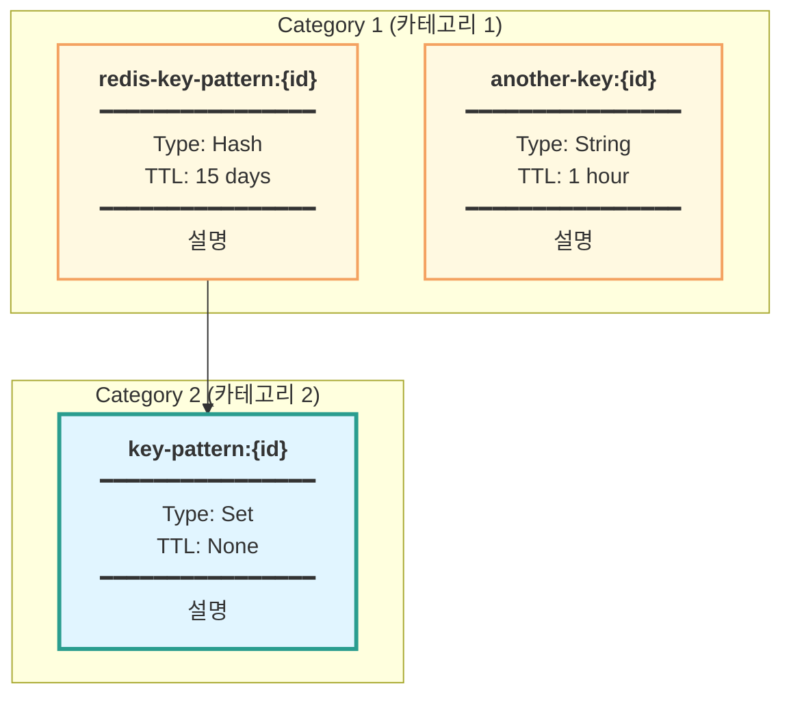

# Mermaid Chart Generation Instructions (Mermaid 차트 생성 지침)

## Overview (개요)
Generate Mermaid charts based on modified code in the current branch, organized by Controller API methods.
(현재 브랜치의 수정된 코드를 기반으로 컨트롤러 API 메서드별 Mermaid 차트를 생성합니다.)

## Chart Types (차트 종류)
Generate the following five types of diagrams for each API endpoint:
(각 API 엔드포인트에 대해 다음 5가지 다이어그램을 생성합니다:)

1. **Class Diagram** (클래스 다이어그램) - Shows class structure and relationships
2. **Sequence Diagram** (시퀀스 다이어그램) - Shows interaction flow between components
3. **Flowchart** (플로우차트) - Shows business logic flow
4. **Redis Type Map** (Redis 타입 맵) - Shows Redis key space structure and data types
5. **Database ERD** (데이터베이스 ERD) - Shows database schema and relationships

### Redis Type Map Format (Redis 타입 맵 형식)
The Redis Type Map should be a simple, focused diagram showing only the Redis keys used by the API:
(Redis 타입 맵은 해당 API에서 사용하는 Redis 키만을 보여주는 간단하고 집중된 다이어그램이어야 합니다:)



**Key Requirements for Redis Type Map** (Redis 타입 맵 주요 요구사항):
- Group keys by logical category (논리적 카테고리별로 키 그룹화)
- Each node must include: Key pattern, Type, TTL, Description (각 노드는 키 패턴, 타입, TTL, 설명 포함)
- Use arrows to show data flow/relationships (화살표로 데이터 흐름/관계 표시)
- Use different colors for different TTL groups (TTL 그룹별로 다른 색상 사용)
- Include a summary table below the chart (차트 아래 요약 테이블 포함)
- **If Redis is not used by the API, show a simple diagram indicating "No Redis usage" (Redis를 사용하지 않는 경우 "Redis 사용 없음" 표시)**

### Sequence Diagram Requirements (시퀀스 다이어그램 요구사항)
For APIs that require authentication, include the security filter chain in the sequence:
(인증이 필요한 API의 경우, 시퀀스 다이어그램에 보안 필터 체인을 포함:)

- `SecurityFilterChain` → `JwtAuthenticationFilter` → `Controller` → `Service` → `Repository`
- Show JWT token validation flow (JWT 토큰 검증 흐름 표시)
- Include `GlobalExceptionHandler` for error handling (에러 처리용 `GlobalExceptionHandler` 포함)
- **Important**: Reflect actual code flow accurately. For example, `signupAndLogin` immediately authenticates after signup, not as separate steps
  (중요: 실제 코드 흐름을 정확히 반영. 예: `signupAndLogin`은 회원가입 후 즉시 인증하므로 별도 단계가 아님)

### Flowchart Requirements (플로우차트 요구사항)
- Show only the business logic flow, avoiding excessive detail (비즈니스 로직 흐름만 표시, 과도한 세부사항 제외)
- Include error handling paths with `GlobalExceptionHandler` (에러 처리 경로에 `GlobalExceptionHandler` 포함)
- Use clear decision points (명확한 결정 지점 사용)
- **Avoid unnecessary duplication**: Combine related operations (e.g., "Generate Access & Refresh Tokens" instead of separate steps)
  (불필요한 중복 제거: 관련 작업을 결합 (예: 별도 단계 대신 "Generate Access & Refresh Tokens"))
- **Reflect actual code flow**: If signup immediately triggers login, show it as a single flow, not separate steps
  (실제 코드 흐름 반영: 회원가입이 즉시 로그인을 트리거하면 별도 단계가 아닌 단일 흐름으로 표시)
- **Specify implementation details**: Include class names for important components (e.g., "BCryptPasswordEncoder" for password encoding, "JwtAuthenticationFilter" for JWT validation)
  (구현 세부사항 명시: 중요 컴포넌트에 클래스명 포함 (예: 비밀번호 인코딩에 "BCryptPasswordEncoder", JWT 검증에 "JwtAuthenticationFilter"))

### Database ERD Requirements (데이터베이스 ERD 요구사항)
- Base schema on `docker/schema/init.sql/init-script.sql` (스키마는 `docker/schema/init.sql/init-script.sql` 기준)
- Show only tables and relationships used by the API (해당 API에서 사용하는 테이블과 관계만 표시)
- Include entity relationships (엔티티 관계 포함)
- Use abbreviated format focusing on relevant tables (관련 테이블에 집중한 축약 형식)

## Naming Rules (네이밍 규칙)

### Folder Structure (폴더 구조)
- Base path: `/doc`
- Preserve package hierarchy from controller's full package name, excluding `org.example.junglebook` and `web.controller`
  (컨트롤러의 전체 패키지 경로에서 `org.example.junglebook`와 `web.controller`를 제외한 나머지 패키지 구조를 폴더로 생성)
- Pattern: `/doc/<remaining-package-path>/<ControllerClassName>/`

### File Naming Pattern (파일명 패턴)
```
/doc/<remaining-package-path>/<ControllerClassName>/<api-method-name>-<chart-type>.md
```

**Package Path Extraction Rules** (패키지 경로 추출 규칙):
1. Take full package name (전체 패키지명 사용)
2. Remove `org.example.junglebook` prefix (`org.example.junglebook` 접두사 제거)
3. Remove `web.controller` segment (`web.controller` 세그먼트 제거)
4. Keep remaining package hierarchy (남은 패키지 계층 유지)
5. Add controller class name as final folder (컨트롤러 클래스명을 마지막 폴더로 추가)

Chart type suffixes (차트 타입 접미사):
- `-class-diagram.md`
- `-sequence.md`
- `-flowchart.md`
- `-redis-typemap.md`
- `-database-erd.md`

## Examples (예시)

### Example 1: PostController
For the following API method (다음 API 메서드의 경우):
```
org.example.junglebook.web.controller.post.PostController#createPost
```

**Step-by-step folder path extraction** (폴더 경로 추출 과정):
1. Full package: `org.example.junglebook.web.controller.post.PostController`
2. Remove `org.example.junglebook`: `web.controller.post.PostController`
3. Remove `web.controller`: `post.PostController`
4. Result path: `/doc/post/PostController/`

Generate files at (다음 경로에 파일 생성):
```
/doc/post/PostController/createPost-class-diagram.md
/doc/post/PostController/createPost-sequence.md
/doc/post/PostController/createPost-flowchart.md
/doc/post/PostController/createPost-redis-typemap.md
/doc/post/PostController/createPost-database-erd.md
```

### Example 2: MemberController
For the following API method (다음 API 메서드의 경우):
```
org.example.junglebook.web.controller.MemberController#signupAndLogin
```

**Step-by-step folder path extraction** (폴더 경로 추출 과정):
1. Full package: `org.example.junglebook.web.controller.MemberController`
2. Remove `org.example.junglebook`: `web.controller.MemberController`
3. Remove `web.controller`: `MemberController`
4. Result path: `/doc/MemberController/`

Generate files at (다음 경로에 파일 생성):
```
/doc/MemberController/signupAndLogin-class-diagram.md
/doc/MemberController/signupAndLogin-sequence.md
/doc/MemberController/signupAndLogin-flowchart.md
/doc/MemberController/signupAndLogin-redis-typemap.md
/doc/MemberController/signupAndLogin-database-erd.md
```

### Example 3: DebateTopicController
For the following API method (다음 API 메서드의 경우):
```
org.example.junglebook.web.controller.debate.DebateTopicController#createTopic
```

**Step-by-step folder path extraction** (폴더 경로 추출 과정):
1. Full package: `org.example.junglebook.web.controller.debate.DebateTopicController`
2. Remove `org.example.junglebook`: `web.controller.debate.DebateTopicController`
3. Remove `web.controller`: `debate.DebateTopicController`
4. Result path: `/doc/debate/DebateTopicController/`

Generate files at (다음 경로에 파일 생성):
```
/doc/debate/DebateTopicController/createTopic-class-diagram.md
/doc/debate/DebateTopicController/createTopic-sequence.md
/doc/debate/DebateTopicController/createTopic-flowchart.md
/doc/debate/DebateTopicController/createTopic-redis-typemap.md
/doc/debate/DebateTopicController/createTopic-database-erd.md
```

## Additional Requirements (추가 요구사항)
- If a diagram file already exists, update it with the latest code changes instead of creating a new file
  (다이어그램 파일이 이미 존재하는 경우, 새 파일을 만들지 말고 최신 코드 변경사항으로 업데이트)
- Update `/doc/README.md` with a table of contents and preview links to all generated diagrams, organized by package structure
  (생성된 모든 다이어그램에 대한 목차와 미리보기 링크를 패키지 구조별로 `/doc/README.md`에 추가)
- Include proper Mermaid syntax with comments (주석이 포함된 올바른 Mermaid 문법 사용)
- Ensure diagrams reflect the actual modified code structure (실제 수정된 코드 구조를 반영)
- Use controller class name as-is for folder naming (preserve case sensitivity)
  (컨트롤러 클래스명은 대소문자를 그대로 유지하여 폴더명으로 사용)
- For Class Diagrams, focus on actual relationships used by the API method (클래스 다이어그램은 해당 API 메서드에서 실제 사용하는 관계에 집중)
- For Sequence Diagrams, include Spring Security filter chain when authentication is required (시퀀스 다이어그램은 인증이 필요한 경우 Spring Security 필터 체인 포함)
- For Flowcharts, show only the business logic flow, avoiding excessive detail (플로우차트는 비즈니스 로직 흐름만 표시, 과도한 세부사항 제외)
- **For Flowcharts, include GlobalExceptionHandler for all error paths** (플로우차트의 모든 에러 경로에 GlobalExceptionHandler 포함)
- **Avoid unnecessary duplication in flowcharts** (플로우차트에서 불필요한 중복 제거)
- **Reflect actual code flow accurately** (실제 코드 흐름을 정확히 반영)
- **Specify implementation details** (구현 세부사항 명시)

## Project-Specific Notes (프로젝트별 참고사항)

### Package Structure (패키지 구조)
- Base package: `org.example.junglebook`
- Controller location: `org.example.junglebook.web.controller.*`
- Service location: `org.example.junglebook.service.*`
- Repository location: `org.example.junglebook.repository.*`
- Entity location: `org.example.junglebook.entity.*`

### Security Flow (보안 흐름)
- JWT authentication is handled by `JwtAuthenticationFilter`
- Security configuration is in `SecurityConfig`
- Public endpoints are defined in `SecurityConfig.PUBLIC_ENDPOINTS`
- Authentication is required for most endpoints except public ones

### Database Schema (데이터베이스 스키마)
- Schema definition: `docker/schema/init.sql/init-script.sql`
- Use this file as the source of truth for database structure
- Focus on tables and relationships relevant to each API

### Redis Usage (Redis 사용)
- Redis usage is limited in this project
- If an API does not use Redis, indicate "No Redis usage" in the Redis Type Map
- Check `RedisConfig` and actual Redis usage in services to determine if Redis is used
