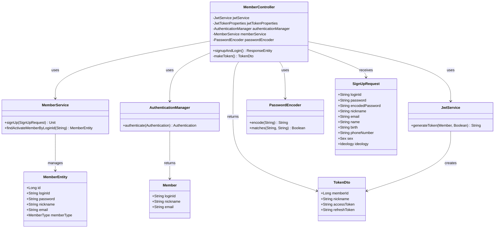

# MemberController.signupAndLogin - Class Diagram

```mermaid
classDiagram
    class MemberController {
        -JwtService jwtService
        -JwtTokenProperties jwtTokenProperties
        -AuthenticationManager authenticationManager
        -MemberService memberService
        -PasswordEncoder passwordEncoder
        +signupAndLogin() ResponseEntity
        -makeToken() TokenDto
    }
    
    class MemberService {
        +signUp(SignUpRequest) Unit
        +findActivateMemberByLoginId(String) MemberEntity
    }
    
    class AuthenticationManager {
        +authenticate(Authentication) Authentication
    }
    
    class JwtService {
        +generateToken(Member, Boolean) String
    }
    
    class PasswordEncoder {
        +encode(String) String
        +matches(String, String) Boolean
    }
    
    class MemberEntity {
        +Long id
        +String loginId
        +String password
        +String nickname
        +String email
        +MemberType memberType
    }
    
    class SignUpRequest {
        +String loginId
        +String password
        +String encodedPassword
        +String nickname
        +String email
        +String name
        +String birth
        +String phoneNumber
        +Sex sex
        +Ideology ideology
    }
    
    class TokenDto {
        +Long memberId
        +String nickname
        +String accessToken
        +String refreshToken
    }
    
    class Member {
        +String loginId
        +String nickname
        +String email
    }
    
    MemberController --> MemberService : uses
    MemberController --> AuthenticationManager : uses
    MemberController --> JwtService : uses
    MemberController --> PasswordEncoder : uses
    MemberController --> SignUpRequest : receives
    MemberController --> TokenDto : returns
    MemberService --> MemberEntity : manages
    AuthenticationManager --> Member : returns
    JwtService --> TokenDto : creates
```

