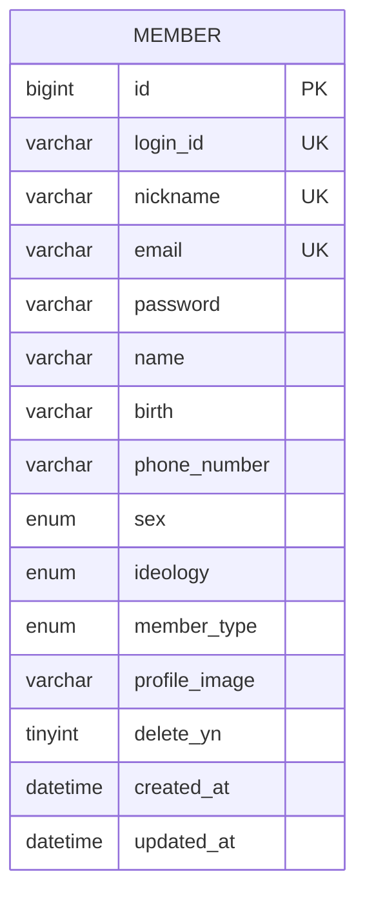

# MemberController.signupAndLogin - Database ERD

## Table Relationships

- **MEMBER**: 독립적인 테이블로, 회원 정보를 저장합니다.
- 회원가입 시 `MEMBER` 테이블에 새 레코드가 생성됩니다.
- 로그인 시 `MEMBER` 테이블에서 `login_id`로 조회하여 인증합니다.

