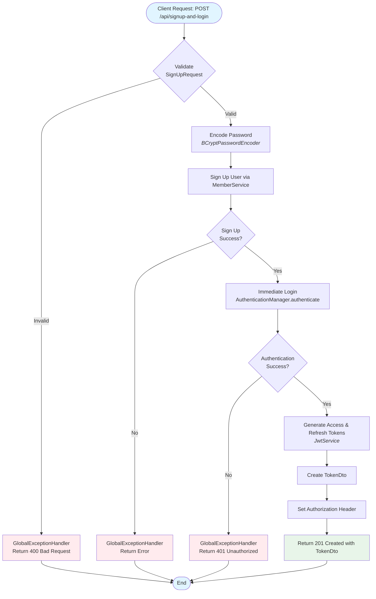

# MemberController.signupAndLogin - Flowchart

```mermaid
flowchart TD
    Start([Client Request: POST /api/signup-and-login]) --> ValidateRequest{Validate<br/>SignUpRequest}
    ValidateRequest -->|Invalid| GlobalExceptionHandler[GlobalExceptionHandler<br/>Return 400 Bad Request]
    ValidateRequest -->|Valid| EncodePassword[Encode Password<br/><i>BCryptPasswordEncoder</i>]
    
    EncodePassword --> SignUp[Sign Up User via MemberService]
    SignUp --> SignUpSuccess{Sign Up<br/>Success?}
    SignUpSuccess -->|No| GlobalExceptionHandler2[GlobalExceptionHandler<br/>Return Error]
    SignUpSuccess -->|Yes| ImmediateLogin[Immediate Login<br/>AuthenticationManager.authenticate]
    
    ImmediateLogin --> AuthSuccess{Authentication<br/>Success?}
    AuthSuccess -->|No| GlobalExceptionHandler3[GlobalExceptionHandler<br/>Return 401 Unauthorized]
    AuthSuccess -->|Yes| GenerateTokens[Generate Access & Refresh Tokens<br/><i>JwtService</i>]
    
    GenerateTokens --> CreateTokenDto[Create TokenDto]
    CreateTokenDto --> SetHeader[Set Authorization Header]
    SetHeader --> Return201[Return 201 Created with TokenDto]
    
    Return201 --> End([End])
    GlobalExceptionHandler --> End
    GlobalExceptionHandler2 --> End
    GlobalExceptionHandler3 --> End
    
    style Start fill:#e1f5ff
    style End fill:#e1f5ff
    style GlobalExceptionHandler fill:#ffebee
    style GlobalExceptionHandler2 fill:#ffebee
    style GlobalExceptionHandler3 fill:#ffebee
    style Return201 fill:#e8f5e9
```
