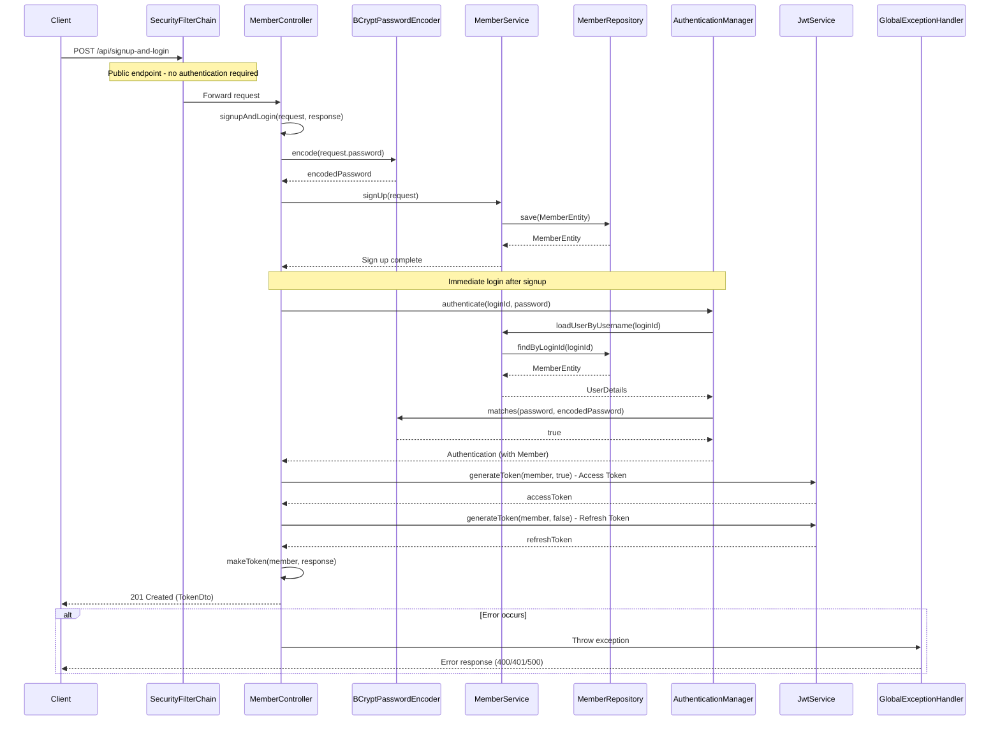

# MemberController.signupAndLogin - Sequence Diagram

```mermaid
sequenceDiagram
    participant Client
    participant SecurityFilterChain
    participant MemberController
    participant PasswordEncoder as BCryptPasswordEncoder
    participant MemberService
    participant MemberRepository
    participant AuthenticationManager
    participant JwtService
    participant GlobalExceptionHandler
    
    Client->>SecurityFilterChain: POST /api/signup-and-login
    Note over SecurityFilterChain: Public endpoint - no authentication required
    SecurityFilterChain->>MemberController: Forward request
    
    MemberController->>MemberController: signupAndLogin(request, response)
    MemberController->>PasswordEncoder: encode(request.password)
    PasswordEncoder-->>MemberController: encodedPassword
    
    MemberController->>MemberService: signUp(request)
    MemberService->>MemberRepository: save(MemberEntity)
    MemberRepository-->>MemberService: MemberEntity
    MemberService-->>MemberController: Sign up complete
    
    Note over MemberController,AuthenticationManager: Immediate login after signup
    MemberController->>AuthenticationManager: authenticate(loginId, password)
    AuthenticationManager->>MemberService: loadUserByUsername(loginId)
    MemberService->>MemberRepository: findByLoginId(loginId)
    MemberRepository-->>MemberService: MemberEntity
    MemberService-->>AuthenticationManager: UserDetails
    AuthenticationManager->>PasswordEncoder: matches(password, encodedPassword)
    PasswordEncoder-->>AuthenticationManager: true
    AuthenticationManager-->>MemberController: Authentication (with Member)
    
    MemberController->>JwtService: generateToken(member, true) - Access Token
    JwtService-->>MemberController: accessToken
    MemberController->>JwtService: generateToken(member, false) - Refresh Token
    JwtService-->>MemberController: refreshToken
    MemberController->>MemberController: makeToken(member, response)
    MemberController-->>Client: 201 Created (TokenDto)
    
    alt Error occurs
        MemberController->>GlobalExceptionHandler: Throw exception
        GlobalExceptionHandler-->>Client: Error response (400/401/500)
    end
```
