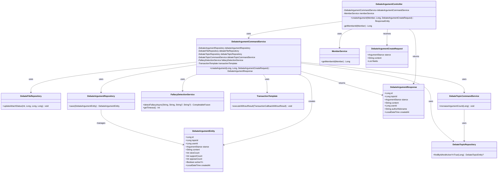

# DebateArgumentController.createArgument - Class Diagram

```mermaid
classDiagram
    class DebateArgumentController {
        -DebateArgumentCommandService debateArgumentCommandService
        -MemberService memberService
        +createArgument(Member, Long, DebateArgumentCreateRequest) ResponseEntity
        -getMemberId(Member) Long
    }
    
    class DebateArgumentCommandService {
        -DebateArgumentRepository debateArgumentRepository
        -DebateFileRepository debateFileRepository
        -DebateTopicRepository debateTopicRepository
        -DebateTopicCommandService debateTopicCommandService
        -FallacyDetectionService fallacyDetectionService
        -TransactionTemplate transactionTemplate
        +createArgument(Long, Long, DebateArgumentCreateRequest) DebateArgumentResponse
    }
    
    class DebateFileRepository {
        +updateAttachStatus(Int, Long, Long, Long) void
    }
    
    class DebateTopicRepository {
        +findByIdAndActiveYnTrue(Long) DebateTopicEntity?
    }
    
    class DebateTopicCommandService {
        +increaseArgumentCount(Long) void
    }
    
    class FallacyDetectionService {
        +detectFallacyAsync(String, String, String?, String?) CompletableFuture
        +getTimeout() Int
    }
    
    class TransactionTemplate {
        +executeWithoutResult(TransactionCallbackWithoutResult) void
    }
    
    class MemberService {
        +getMemberId(Member) Long
    }
    
    class DebateArgumentRepository {
        +save(DebateArgumentEntity) DebateArgumentEntity
    }
    
    class DebateArgumentEntity {
        +Long id
        +Long topicId
        +Long userId
        +ArgumentStance stance
        +String content
        +Int viewCount
        +Int supportCount
        +Int opposeCount
        +Boolean activeYn
        +LocalDateTime createdAt
    }
    
    class DebateArgumentCreateRequest {
        +ArgumentStance stance
        +String content
        +List fileIds
    }
    
    class DebateArgumentResponse {
        +Long id
        +Long topicId
        +ArgumentStance stance
        +String content
        +Long userId
        +String authorNickname
        +LocalDateTime createdAt
    }
    
    DebateArgumentController --> DebateArgumentCommandService : uses
    DebateArgumentController --> MemberService : uses
    DebateArgumentCommandService --> DebateArgumentRepository : uses
    DebateArgumentCommandService --> DebateFileRepository : uses
    DebateArgumentCommandService --> DebateTopicRepository : uses
    DebateArgumentCommandService --> DebateTopicCommandService : uses
    DebateArgumentCommandService --> FallacyDetectionService : uses
    DebateArgumentCommandService --> TransactionTemplate : uses
    DebateArgumentRepository --> DebateArgumentEntity : manages
    DebateArgumentCommandService --> DebateArgumentEntity : creates
    DebateArgumentCommandService --> DebateArgumentResponse : returns
    DebateArgumentController --> DebateArgumentCreateRequest : receives
    DebateArgumentController --> DebateArgumentResponse : returns
    DebateTopicCommandService --> DebateTopicRepository : uses
```

