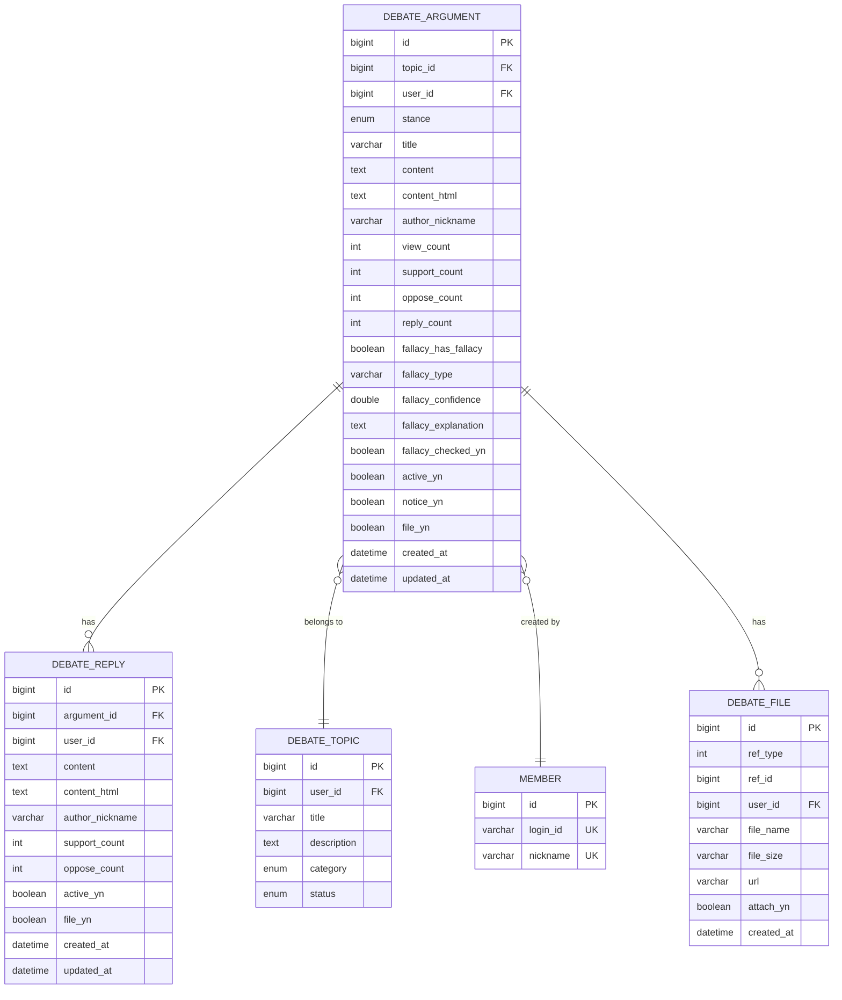

# DebateArgumentController.createArgument - Database ERD

## Table Relationships

- **DEBATE_ARGUMENT** → **DEBATE_TOPIC**: Many-to-One (논증은 하나의 토픽에 속함)
- **DEBATE_ARGUMENT** → **MEMBER**: Many-to-One (논증은 하나의 회원이 작성)
- **DEBATE_ARGUMENT** → **DEBATE_REPLY**: One-to-Many (논증은 여러 댓글을 가질 수 있음)
- **DEBATE_ARGUMENT** → **DEBATE_FILE**: One-to-Many (논증은 여러 파일을 가질 수 있음)
- **DEBATE_ARGUMENT**: 논리 오류 정보는 테이블 내부 필드로 관리됨 (fallacy_has_fallacy, fallacy_type, fallacy_confidence, fallacy_explanation)

