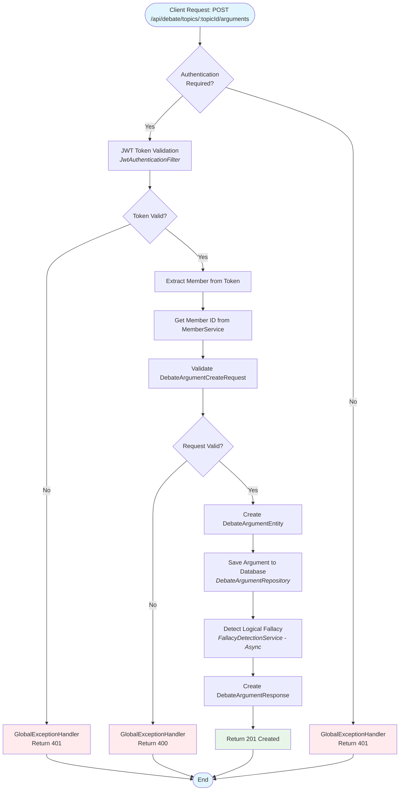

# DebateArgumentController.createArgument - Flowchart

```mermaid
flowchart TD
    Start([Client Request: POST /api/debate/topics/:topicId/arguments]) --> AuthCheck{Authentication<br/>Required?}
    AuthCheck -->|Yes| JWTValidate[JWT Token Validation<br/><i>JwtAuthenticationFilter</i>]
    AuthCheck -->|No| GlobalExceptionHandler1[GlobalExceptionHandler<br/>Return 401]
    
    JWTValidate --> TokenValid{Token Valid?}
    TokenValid -->|No| GlobalExceptionHandler2[GlobalExceptionHandler<br/>Return 401]
    TokenValid -->|Yes| ExtractMember[Extract Member from Token]
    
    ExtractMember --> GetMemberId[Get Member ID from MemberService]
    GetMemberId --> ValidateRequest[Validate DebateArgumentCreateRequest]
    
    ValidateRequest --> RequestValid{Request Valid?}
    RequestValid -->|No| GlobalExceptionHandler3[GlobalExceptionHandler<br/>Return 400]
    RequestValid -->|Yes| CreateArgumentEntity[Create DebateArgumentEntity]
    
    CreateArgumentEntity --> SaveArgument[Save Argument to Database<br/><i>DebateArgumentRepository</i>]
    SaveArgument --> DetectFallacy[Detect Logical Fallacy<br/><i>FallacyDetectionService - Async</i>]
    DetectFallacy --> CreateResponse[Create DebateArgumentResponse]
    CreateResponse --> Return201[Return 201 Created]
    
    Return201 --> End([End])
    GlobalExceptionHandler1 --> End
    GlobalExceptionHandler2 --> End
    GlobalExceptionHandler3 --> End
    
    style Start fill:#e1f5ff
    style End fill:#e1f5ff
    style GlobalExceptionHandler1 fill:#ffebee
    style GlobalExceptionHandler2 fill:#ffebee
    style GlobalExceptionHandler3 fill:#ffebee
    style Return201 fill:#e8f5e9
```
