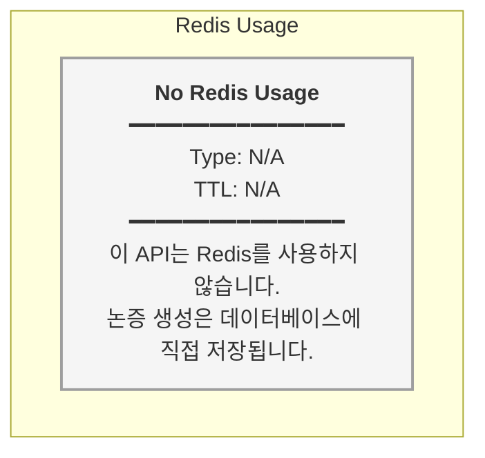

# DebateArgumentController.createArgument - Redis Type Map

## Redis Key Summary

| Key Pattern | Type | TTL | Description |
|------------|------|-----|-------------|
| N/A | N/A | N/A | 이 API는 Redis를 사용하지 않습니다. |

