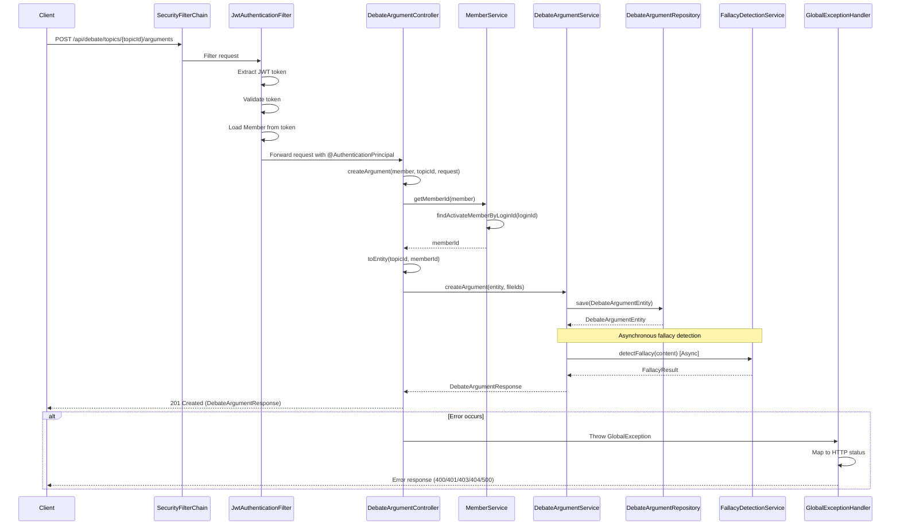

# DebateArgumentController.createArgument - Sequence Diagram

```mermaid
sequenceDiagram
    participant Client
    participant SecurityFilterChain
    participant JwtAuthenticationFilter
    participant DebateArgumentController
    participant MemberService
    participant DebateArgumentService
    participant DebateArgumentRepository
    participant FallacyDetectionService
    participant GlobalExceptionHandler
    
    Client->>SecurityFilterChain: POST /api/debate/topics/{topicId}/arguments
    SecurityFilterChain->>JwtAuthenticationFilter: Filter request
    JwtAuthenticationFilter->>JwtAuthenticationFilter: Extract JWT token
    JwtAuthenticationFilter->>JwtAuthenticationFilter: Validate token
    JwtAuthenticationFilter->>JwtAuthenticationFilter: Load Member from token
    JwtAuthenticationFilter->>DebateArgumentController: Forward request with @AuthenticationPrincipal
    
    DebateArgumentController->>DebateArgumentController: createArgument(member, topicId, request)
    DebateArgumentController->>MemberService: getMemberId(member)
    MemberService->>MemberService: findActivateMemberByLoginId(loginId)
    MemberService-->>DebateArgumentController: memberId
    
    DebateArgumentController->>DebateArgumentController: toEntity(topicId, memberId)
    DebateArgumentController->>DebateArgumentService: createArgument(entity, fileIds)
    DebateArgumentService->>DebateArgumentRepository: save(DebateArgumentEntity)
    DebateArgumentRepository-->>DebateArgumentService: DebateArgumentEntity
    
    Note over DebateArgumentService,FallacyDetectionService: Asynchronous fallacy detection
    DebateArgumentService->>FallacyDetectionService: detectFallacy(content) [Async]
    FallacyDetectionService-->>DebateArgumentService: FallacyResult
    
    DebateArgumentService-->>DebateArgumentController: DebateArgumentResponse
    DebateArgumentController-->>Client: 201 Created (DebateArgumentResponse)
    
    alt Error occurs
        DebateArgumentController->>GlobalExceptionHandler: Throw GlobalException
        GlobalExceptionHandler->>GlobalExceptionHandler: Map to HTTP status
        GlobalExceptionHandler-->>Client: Error response (400/401/403/404/500)
    end
```
