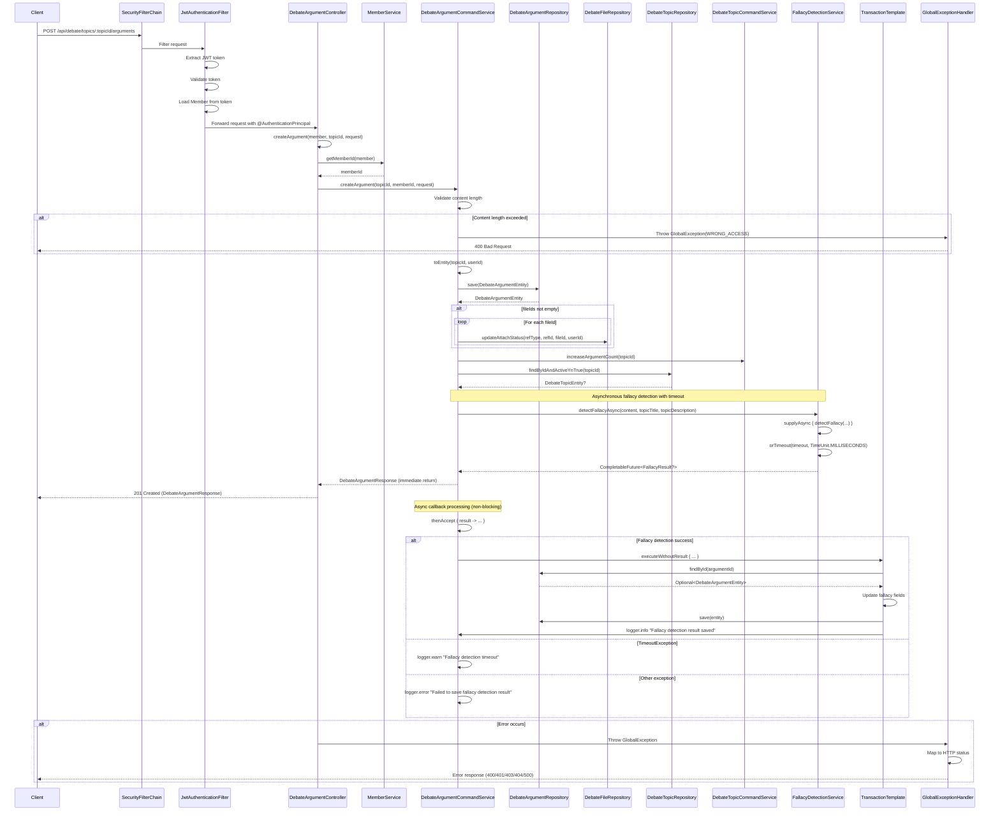

# DebateArgumentController.createArgument - Sequence Diagram

```mermaid
sequenceDiagram
    participant Client
    participant SecurityFilterChain
    participant JwtAuthenticationFilter
    participant DebateArgumentController
    participant MemberService
    participant DebateArgumentCommandService
    participant DebateArgumentRepository
    participant DebateFileRepository
    participant DebateTopicRepository
    participant DebateTopicCommandService
    participant FallacyDetectionService
    participant TransactionTemplate
    participant GlobalExceptionHandler
    
    Client->>SecurityFilterChain: POST /api/debate/topics/:topicId/arguments
    SecurityFilterChain->>JwtAuthenticationFilter: Filter request
    JwtAuthenticationFilter->>JwtAuthenticationFilter: Extract JWT token
    JwtAuthenticationFilter->>JwtAuthenticationFilter: Validate token
    JwtAuthenticationFilter->>JwtAuthenticationFilter: Load Member from token
    JwtAuthenticationFilter->>DebateArgumentController: Forward request with @AuthenticationPrincipal
    
    DebateArgumentController->>DebateArgumentController: createArgument(member, topicId, request)
    DebateArgumentController->>MemberService: getMemberId(member)
    MemberService-->>DebateArgumentController: memberId
    
    DebateArgumentController->>DebateArgumentCommandService: createArgument(topicId, memberId, request)
    DebateArgumentCommandService->>DebateArgumentCommandService: Validate content length
    alt Content length exceeded
        DebateArgumentCommandService->>GlobalExceptionHandler: Throw GlobalException(WRONG_ACCESS)
        GlobalExceptionHandler-->>Client: 400 Bad Request
    end
    DebateArgumentCommandService->>DebateArgumentCommandService: toEntity(topicId, userId)
    DebateArgumentCommandService->>DebateArgumentRepository: save(DebateArgumentEntity)
    DebateArgumentRepository-->>DebateArgumentCommandService: DebateArgumentEntity
    
    alt fileIds not empty
        loop For each fileId
            DebateArgumentCommandService->>DebateFileRepository: updateAttachStatus(refType, refId, fileId, userId)
        end
    end
    
    DebateArgumentCommandService->>DebateTopicCommandService: increaseArgumentCount(topicId)
    DebateArgumentCommandService->>DebateTopicRepository: findByIdAndActiveYnTrue(topicId)
    DebateTopicRepository-->>DebateArgumentCommandService: DebateTopicEntity?
    
    Note over DebateArgumentCommandService,FallacyDetectionService: Asynchronous fallacy detection with timeout
    DebateArgumentCommandService->>FallacyDetectionService: detectFallacyAsync(content, topicTitle, topicDescription)
    FallacyDetectionService->>FallacyDetectionService: supplyAsync { detectFallacy(...) }
    FallacyDetectionService->>FallacyDetectionService: orTimeout(timeout, TimeUnit.MILLISECONDS)
    FallacyDetectionService-->>DebateArgumentCommandService: CompletableFuture<FallacyResult?>
    
    DebateArgumentCommandService-->>DebateArgumentController: DebateArgumentResponse (immediate return)
    DebateArgumentController-->>Client: 201 Created (DebateArgumentResponse)
    
    Note over DebateArgumentCommandService: Async callback processing (non-blocking)
    DebateArgumentCommandService->>DebateArgumentCommandService: thenAccept { result -> ... }
    alt Fallacy detection success
        DebateArgumentCommandService->>TransactionTemplate: executeWithoutResult { ... }
        TransactionTemplate->>DebateArgumentRepository: findById(argumentId)
        DebateArgumentRepository-->>TransactionTemplate: Optional<DebateArgumentEntity>
        TransactionTemplate->>TransactionTemplate: Update fallacy fields
        TransactionTemplate->>DebateArgumentRepository: save(entity)
        TransactionTemplate->>DebateArgumentCommandService: logger.info "Fallacy detection result saved"
    else TimeoutException
        DebateArgumentCommandService->>DebateArgumentCommandService: logger.warn "Fallacy detection timeout"
    else Other exception
        DebateArgumentCommandService->>DebateArgumentCommandService: logger.error "Failed to save fallacy detection result"
    end
    
    alt Error occurs
        DebateArgumentController->>GlobalExceptionHandler: Throw GlobalException
        GlobalExceptionHandler->>GlobalExceptionHandler: Map to HTTP status
        GlobalExceptionHandler-->>Client: Error response (400/401/403/404/500)
    end
```
