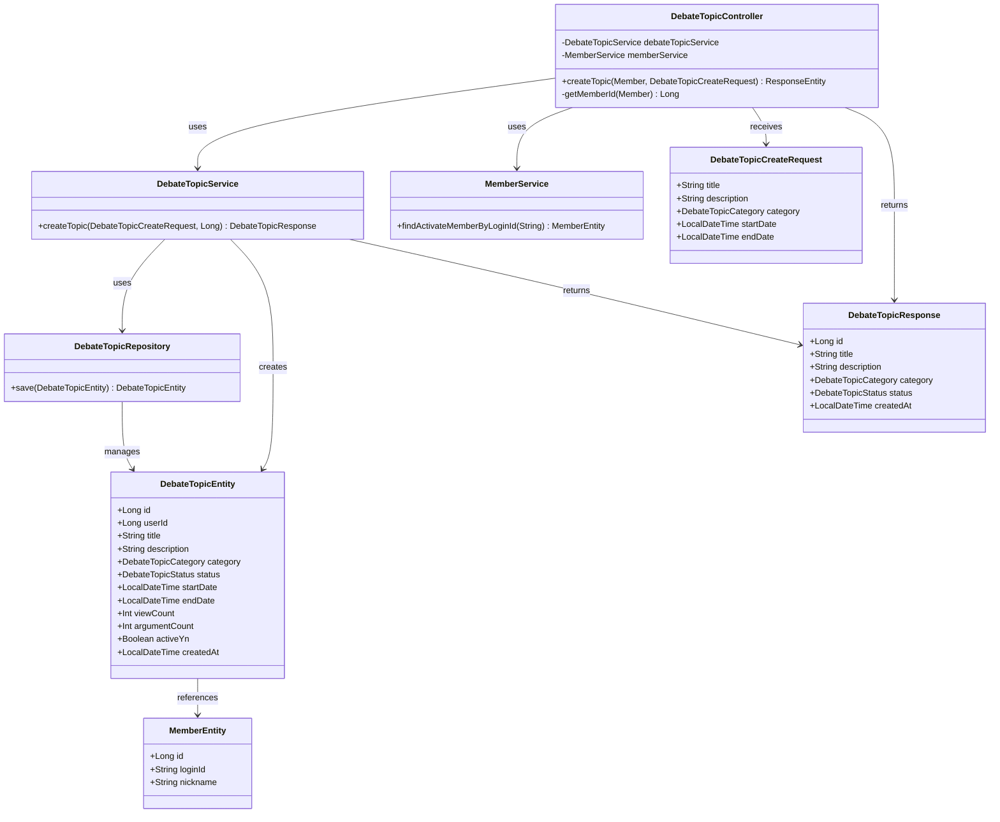

# DebateTopicController.createTopic - Class Diagram

```mermaid
classDiagram
    class DebateTopicController {
        -DebateTopicService debateTopicService
        -MemberService memberService
        +createTopic(Member, DebateTopicCreateRequest) ResponseEntity
        -getMemberId(Member) Long
    }
    
    class DebateTopicService {
        +createTopic(DebateTopicCreateRequest, Long) DebateTopicResponse
    }
    
    class MemberService {
        +findActivateMemberByLoginId(String) MemberEntity
    }
    
    class DebateTopicRepository {
        +save(DebateTopicEntity) DebateTopicEntity
    }
    
    class DebateTopicEntity {
        +Long id
        +Long userId
        +String title
        +String description
        +DebateTopicCategory category
        +DebateTopicStatus status
        +LocalDateTime startDate
        +LocalDateTime endDate
        +Int viewCount
        +Int argumentCount
        +Boolean activeYn
        +LocalDateTime createdAt
    }
    
    class DebateTopicCreateRequest {
        +String title
        +String description
        +DebateTopicCategory category
        +LocalDateTime startDate
        +LocalDateTime endDate
    }
    
    class DebateTopicResponse {
        +Long id
        +String title
        +String description
        +DebateTopicCategory category
        +DebateTopicStatus status
        +LocalDateTime createdAt
    }
    
    class MemberEntity {
        +Long id
        +String loginId
        +String nickname
    }
    
    DebateTopicController --> DebateTopicService : uses
    DebateTopicController --> MemberService : uses
    DebateTopicService --> DebateTopicRepository : uses
    DebateTopicRepository --> DebateTopicEntity : manages
    DebateTopicService --> DebateTopicEntity : creates
    DebateTopicService --> DebateTopicResponse : returns
    DebateTopicController --> DebateTopicCreateRequest : receives
    DebateTopicController --> DebateTopicResponse : returns
    DebateTopicEntity --> MemberEntity : references
```

