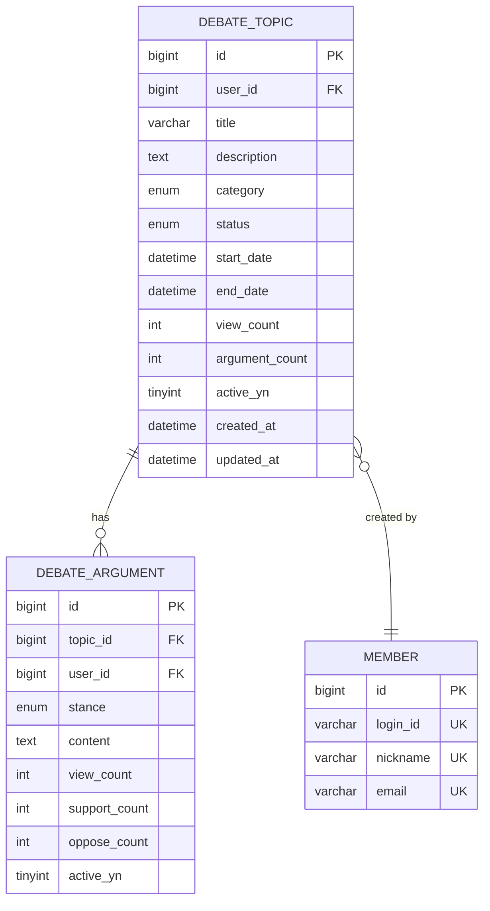

# DebateTopicController.createTopic - Database ERD

## Table Relationships

- **DEBATE_TOPIC** → **MEMBER**: Many-to-One (토픽은 하나의 회원이 생성)
- **DEBATE_TOPIC** → **DEBATE_ARGUMENT**: One-to-Many (토픽은 여러 논증을 가질 수 있음)

