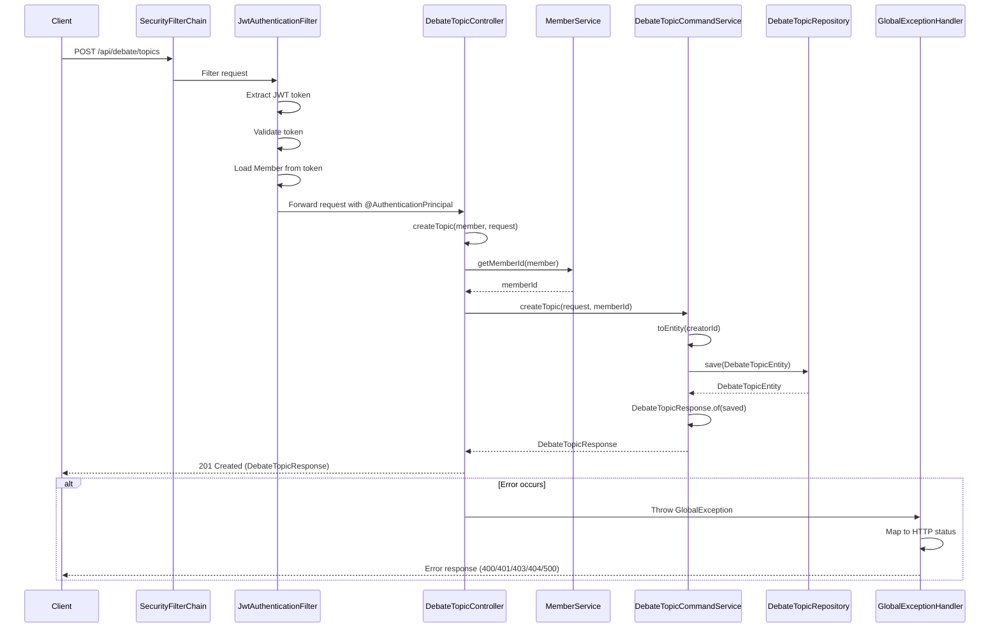

# DebateTopicController.createTopic - Sequence Diagram

```mermaid
sequenceDiagram
    participant Client
    participant SecurityFilterChain
    participant JwtAuthenticationFilter
    participant DebateTopicController
    participant MemberService
    participant DebateTopicCommandService
    participant DebateTopicRepository
    participant GlobalExceptionHandler
    
    Client->>SecurityFilterChain: POST /api/debate/topics
    SecurityFilterChain->>JwtAuthenticationFilter: Filter request
    JwtAuthenticationFilter->>JwtAuthenticationFilter: Extract JWT token
    JwtAuthenticationFilter->>JwtAuthenticationFilter: Validate token
    JwtAuthenticationFilter->>JwtAuthenticationFilter: Load Member from token
    JwtAuthenticationFilter->>DebateTopicController: Forward request with @AuthenticationPrincipal
    
    DebateTopicController->>DebateTopicController: createTopic(member, request)
    DebateTopicController->>MemberService: getMemberId(member)
    MemberService-->>DebateTopicController: memberId
    
    DebateTopicController->>DebateTopicCommandService: createTopic(request, memberId)
    DebateTopicCommandService->>DebateTopicCommandService: toEntity(creatorId)
    DebateTopicCommandService->>DebateTopicRepository: save(DebateTopicEntity)
    DebateTopicRepository-->>DebateTopicCommandService: DebateTopicEntity
    DebateTopicCommandService->>DebateTopicCommandService: DebateTopicResponse.of(saved)
    DebateTopicCommandService-->>DebateTopicController: DebateTopicResponse
    
    DebateTopicController-->>Client: 201 Created (DebateTopicResponse)
    
    alt Error occurs
        DebateTopicController->>GlobalExceptionHandler: Throw GlobalException
        GlobalExceptionHandler->>GlobalExceptionHandler: Map to HTTP status
        GlobalExceptionHandler-->>Client: Error response (400/401/403/404/500)
    end
```
