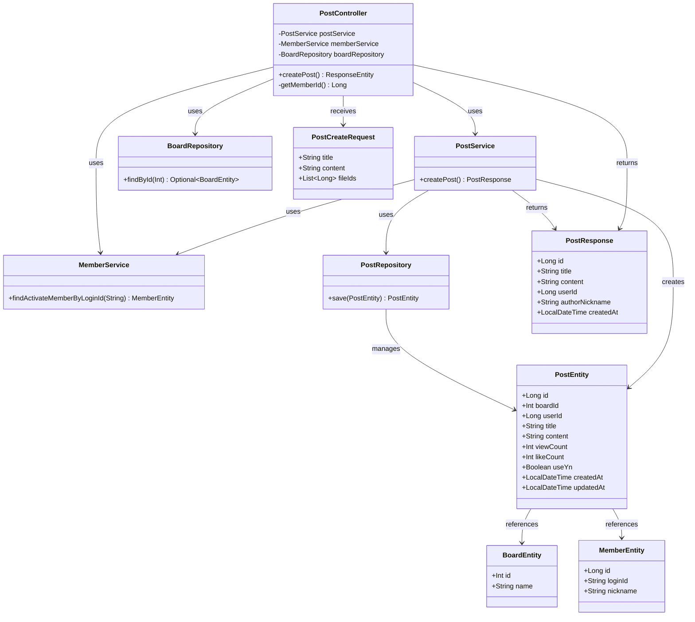

# PostController.createPost - Class Diagram

```mermaid
classDiagram
    class PostController {
        -PostService postService
        -MemberService memberService
        -BoardRepository boardRepository
        +createPost() ResponseEntity
        -getMemberId() Long
    }
    
    class PostService {
        +createPost() PostResponse
    }
    
    class MemberService {
        +findActivateMemberByLoginId(String) MemberEntity
    }
    
    class BoardRepository {
        +findById(Int) Optional~BoardEntity~
    }
    
    class PostRepository {
        +save(PostEntity) PostEntity
    }
    
    class PostEntity {
        +Long id
        +Int boardId
        +Long userId
        +String title
        +String content
        +Int viewCount
        +Int likeCount
        +Boolean useYn
        +LocalDateTime createdAt
        +LocalDateTime updatedAt
    }
    
    class BoardEntity {
        +Int id
        +String name
    }
    
    class MemberEntity {
        +Long id
        +String loginId
        +String nickname
    }
    
    class PostCreateRequest {
        +String title
        +String content
        +List~Long~ fileIds
    }
    
    class PostResponse {
        +Long id
        +String title
        +String content
        +Long userId
        +String authorNickname
        +LocalDateTime createdAt
    }
    
    PostController --> PostService : uses
    PostController --> MemberService : uses
    PostController --> BoardRepository : uses
    PostService --> PostRepository : uses
    PostService --> MemberService : uses
    PostRepository --> PostEntity : manages
    PostService --> PostEntity : creates
    PostService --> PostResponse : returns
    PostController --> PostCreateRequest : receives
    PostController --> PostResponse : returns
    PostEntity --> BoardEntity : references
    PostEntity --> MemberEntity : references
```

