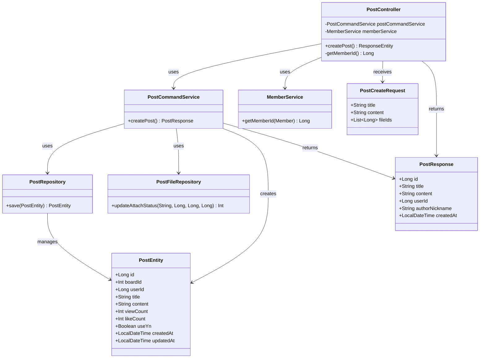

# PostController.createPost - Class Diagram

```mermaid
classDiagram
    class PostController {
        -PostCommandService postCommandService
        -MemberService memberService
        +createPost() ResponseEntity
        -getMemberId() Long
    }
    
    class PostCommandService {
        +createPost() PostResponse
    }
    
    class MemberService {
        +getMemberId(Member) Long
    }
    
    class PostRepository {
        +save(PostEntity) PostEntity
    }
    
    class PostFileRepository {
        +updateAttachStatus(String, Long, Long, Long) Int
    }
    
    class PostEntity {
        +Long id
        +Int boardId
        +Long userId
        +String title
        +String content
        +Int viewCount
        +Int likeCount
        +Boolean useYn
        +LocalDateTime createdAt
        +LocalDateTime updatedAt
    }
    
    class PostCreateRequest {
        +String title
        +String content
        +List~Long~ fileIds
    }
    
    class PostResponse {
        +Long id
        +String title
        +String content
        +Long userId
        +String authorNickname
        +LocalDateTime createdAt
    }
    
    PostController --> PostCommandService : uses
    PostController --> MemberService : uses
    PostCommandService --> PostRepository : uses
    PostCommandService --> PostFileRepository : uses
    PostRepository --> PostEntity : manages
    PostCommandService --> PostEntity : creates
    PostCommandService --> PostResponse : returns
    PostController --> PostCreateRequest : receives
    PostController --> PostResponse : returns
```

