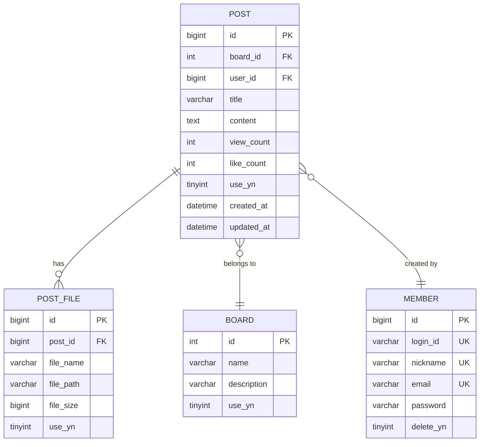

# PostController.createPost - Database ERD

## Table Relationships

- **POST** → **BOARD**: Many-to-One (게시글은 하나의 게시판에 속함)
- **POST** → **MEMBER**: Many-to-One (게시글은 하나의 회원이 작성)
- **POST** → **POST_FILE**: One-to-Many (게시글은 여러 파일을 가질 수 있음)

