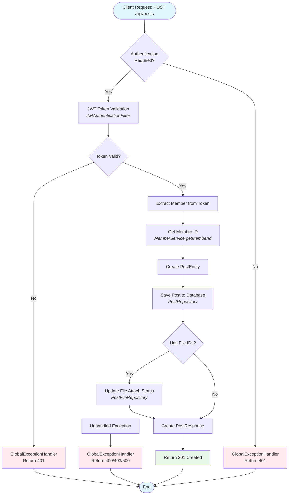

# PostController.createPost - Flowchart

```mermaid
flowchart TD
    Start([Client Request: POST /api/posts]) --> AuthCheck{Authentication<br/>Required?}
    AuthCheck -->|Yes| JWTValidate[JWT Token Validation<br/><i>JwtAuthenticationFilter</i>]
    AuthCheck -->|No| GlobalExceptionHandler1[GlobalExceptionHandler<br/>Return 401]
    
    JWTValidate --> TokenValid{Token Valid?}
    TokenValid -->|No| GlobalExceptionHandler2[GlobalExceptionHandler<br/>Return 401]
    TokenValid -->|Yes| ExtractMember[Extract Member from Token]
    
    ExtractMember --> GetMemberId[Get Member ID<br/><i>MemberService.getMemberId</i>]
    GetMemberId --> CreatePostEntity[Create PostEntity]
    
    CreatePostEntity --> SavePost[Save Post to Database<br/><i>PostRepository</i>]
    SavePost --> CheckFiles{Has File IDs?}
    CheckFiles -->|Yes| UpdateFiles[Update File Attach Status<br/><i>PostFileRepository</i>]
    CheckFiles -->|No| CreateResponse[Create PostResponse]
    UpdateFiles --> CreateResponse[Create PostResponse]
    CreateResponse --> Return201[Return 201 Created]
    
    Return201 --> End([End])
    GlobalExceptionHandler1 --> End
    GlobalExceptionHandler2 --> End
    
    ErrorPath[Unhandled Exception] --> GlobalExceptionHandler3[GlobalExceptionHandler<br/>Return 400/403/500]
    GlobalExceptionHandler3 --> End
    
    style Start fill:#e1f5ff
    style End fill:#e1f5ff
    style GlobalExceptionHandler1 fill:#ffebee
    style GlobalExceptionHandler2 fill:#ffebee
    style GlobalExceptionHandler3 fill:#ffebee
    style Return201 fill:#e8f5e9
```
