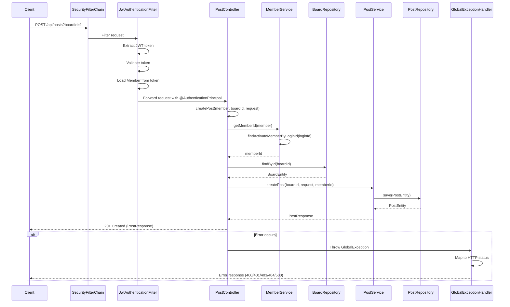

# PostController.createPost - Sequence Diagram

```mermaid
sequenceDiagram
    participant Client
    participant SecurityFilterChain
    participant JwtAuthenticationFilter
    participant PostController
    participant MemberService
    participant BoardRepository
    participant PostService
    participant PostRepository
    participant GlobalExceptionHandler
    
    Client->>SecurityFilterChain: POST /api/posts?boardId=1
    SecurityFilterChain->>JwtAuthenticationFilter: Filter request
    JwtAuthenticationFilter->>JwtAuthenticationFilter: Extract JWT token
    JwtAuthenticationFilter->>JwtAuthenticationFilter: Validate token
    JwtAuthenticationFilter->>JwtAuthenticationFilter: Load Member from token
    JwtAuthenticationFilter->>PostController: Forward request with @AuthenticationPrincipal
    
    PostController->>PostController: createPost(member, boardId, request)
    PostController->>MemberService: getMemberId(member)
    MemberService->>MemberService: findActivateMemberByLoginId(loginId)
    MemberService-->>PostController: memberId
    
    PostController->>BoardRepository: findById(boardId)
    BoardRepository-->>PostController: BoardEntity
    
    PostController->>PostService: createPost(boardId, request, memberId)
    PostService->>PostRepository: save(PostEntity)
    PostRepository-->>PostService: PostEntity
    PostService-->>PostController: PostResponse
    
    PostController-->>Client: 201 Created (PostResponse)
    
    alt Error occurs
        PostController->>GlobalExceptionHandler: Throw GlobalException
        GlobalExceptionHandler->>GlobalExceptionHandler: Map to HTTP status
        GlobalExceptionHandler-->>Client: Error response (400/401/403/404/500)
    end
```
