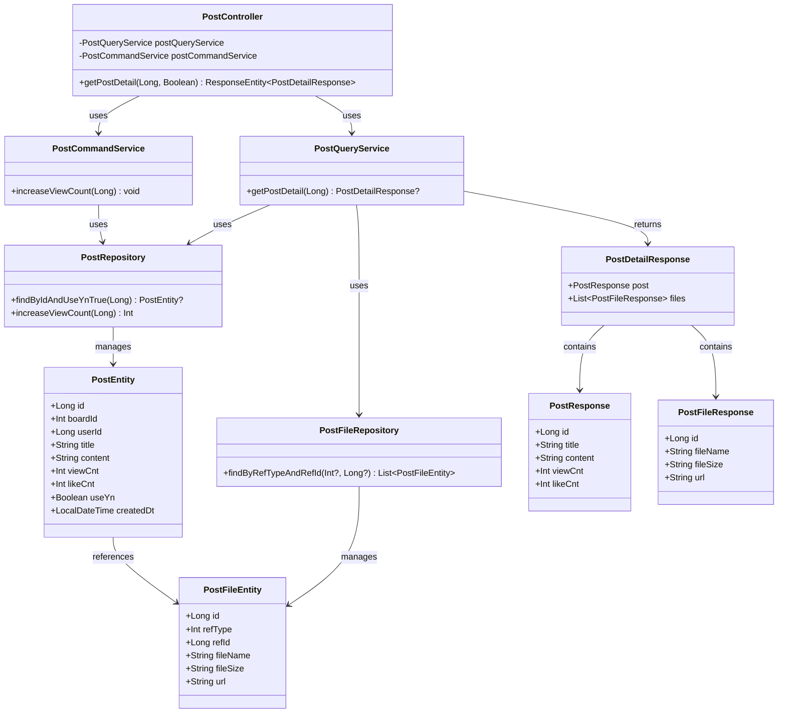

# PostController.getPostDetail - Class Diagram

```mermaid
classDiagram
    class PostController {
        -PostQueryService postQueryService
        -PostCommandService postCommandService
        +getPostDetail(Long, Boolean) ResponseEntity~PostDetailResponse~
    }
    
    class PostQueryService {
        +getPostDetail(Long) PostDetailResponse?
    }
    
    class PostCommandService {
        +increaseViewCount(Long) void
    }
    
    class PostRepository {
        +findByIdAndUseYnTrue(Long) PostEntity?
        +increaseViewCount(Long) Int
    }
    
    class PostFileRepository {
        +findByRefTypeAndRefId(Int?, Long?) List~PostFileEntity~
    }
    
    class PostEntity {
        +Long id
        +Int boardId
        +Long userId
        +String title
        +String content
        +Int viewCnt
        +Int likeCnt
        +Boolean useYn
        +LocalDateTime createdDt
    }
    
    class PostFileEntity {
        +Long id
        +Int refType
        +Long refId
        +String fileName
        +String fileSize
        +String url
    }
    
    class PostDetailResponse {
        +PostResponse post
        +List~PostFileResponse~ files
    }
    
    class PostResponse {
        +Long id
        +String title
        +String content
        +Int viewCnt
        +Int likeCnt
    }
    
    class PostFileResponse {
        +Long id
        +String fileName
        +String fileSize
        +String url
    }
    
    PostController --> PostQueryService : uses
    PostController --> PostCommandService : uses
    PostQueryService --> PostRepository : uses
    PostQueryService --> PostFileRepository : uses
    PostCommandService --> PostRepository : uses
    PostRepository --> PostEntity : manages
    PostFileRepository --> PostFileEntity : manages
    PostQueryService --> PostDetailResponse : returns
    PostDetailResponse --> PostResponse : contains
    PostDetailResponse --> PostFileResponse : contains
    PostEntity --> PostFileEntity : references
```

