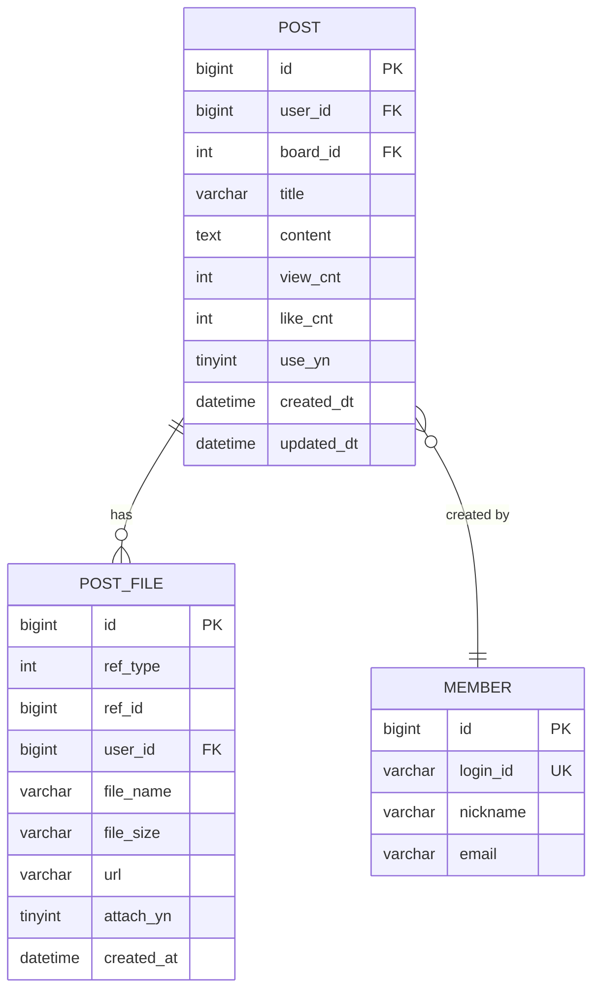

# PostController.getPostDetail - Database ERD

## Table Relationships

- **POST** → **POST_FILE**: One-to-Many (게시글은 여러 파일을 가질 수 있음, ref_type=1, ref_id=post.id)
- **POST** → **MEMBER**: Many-to-One (게시글은 하나의 회원이 작성)

