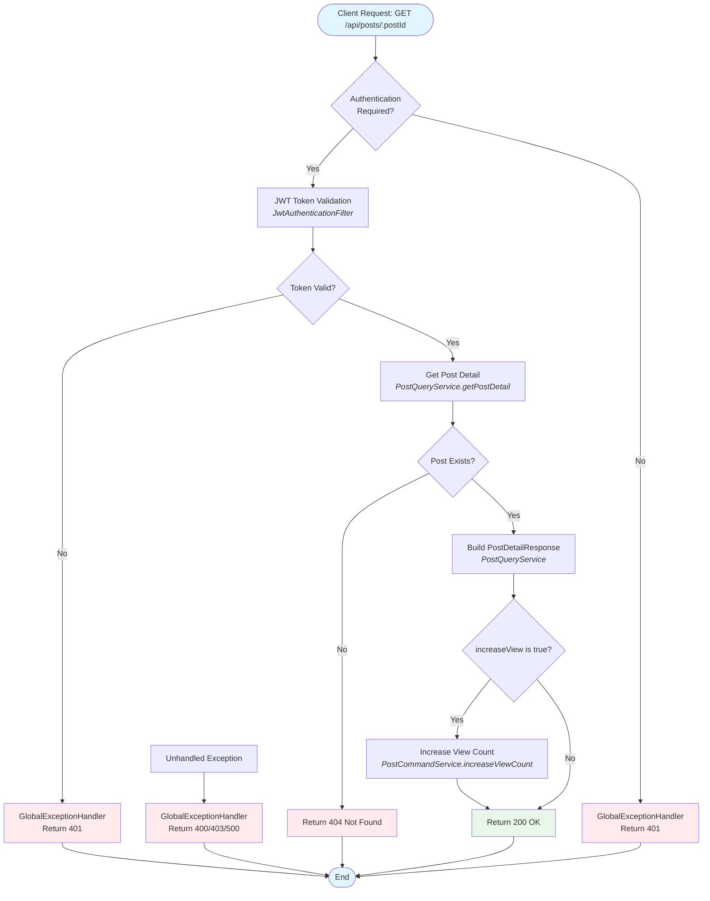

# PostController.getPostDetail - Flowchart

```mermaid
flowchart TD
    Start([Client Request: GET /api/posts/:postId]) --> AuthCheck{Authentication<br/>Required?}
    AuthCheck -->|Yes| JWTValidate[JWT Token Validation<br/><i>JwtAuthenticationFilter</i>]
    AuthCheck -->|No| GlobalExceptionHandler1[GlobalExceptionHandler<br/>Return 401]
    
    JWTValidate --> TokenValid{Token Valid?}
    TokenValid -->|No| GlobalExceptionHandler2[GlobalExceptionHandler<br/>Return 401]
    TokenValid -->|Yes| GetPost[Get Post Detail<br/><i>PostQueryService.getPostDetail</i>]
    
    GetPost --> PostExists{Post Exists?}
    PostExists -->|No| Return404[Return 404 Not Found]
    PostExists -->|Yes| BuildResponse[Build PostDetailResponse<br/><i>PostQueryService</i>]
    
    BuildResponse --> CheckIncreaseView{increaseView is true?}
    CheckIncreaseView -->|Yes| IncreaseView[Increase View Count<br/><i>PostCommandService.increaseViewCount</i>]
    CheckIncreaseView -->|No| Return200[Return 200 OK]
    IncreaseView --> Return200
    
    Return200 --> End([End])
    Return404 --> End
    GlobalExceptionHandler1 --> End
    GlobalExceptionHandler2 --> End
    
    ErrorPath[Unhandled Exception] --> GlobalExceptionHandler3[GlobalExceptionHandler<br/>Return 400/403/500]
    GlobalExceptionHandler3 --> End
    
    style Start fill:#e1f5ff
    style End fill:#e1f5ff
    style Return200 fill:#e8f5e9
    style Return404 fill:#ffebee
    style GlobalExceptionHandler1 fill:#ffebee
    style GlobalExceptionHandler2 fill:#ffebee
    style GlobalExceptionHandler3 fill:#ffebee
```

