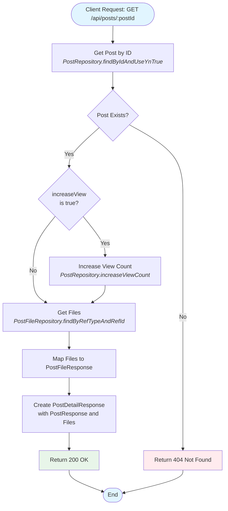

# PostController.getPostDetail - Flowchart

```mermaid
flowchart TD
    Start([Client Request: GET /api/posts/:postId]) --> GetPost[Get Post by ID<br/><i>PostRepository.findByIdAndUseYnTrue</i>]
    
    GetPost --> PostExists{Post Exists?}
    PostExists -->|No| Return404[Return 404 Not Found]
    PostExists -->|Yes| CheckIncreaseView{increaseView<br/>is true?}
    
    CheckIncreaseView -->|Yes| IncreaseView[Increase View Count<br/><i>PostRepository.increaseViewCount</i>]
    CheckIncreaseView -->|No| GetFiles[Get Files<br/><i>PostFileRepository.findByRefTypeAndRefId</i>]
    IncreaseView --> GetFiles
    
    GetFiles --> MapFiles[Map Files to PostFileResponse]
    MapFiles --> CreateResponse[Create PostDetailResponse<br/>with PostResponse and Files]
    CreateResponse --> Return200[Return 200 OK]
    
    Return200 --> End([End])
    Return404 --> End
    
    style Start fill:#e1f5ff
    style End fill:#e1f5ff
    style Return200 fill:#e8f5e9
    style Return404 fill:#ffebee
```

