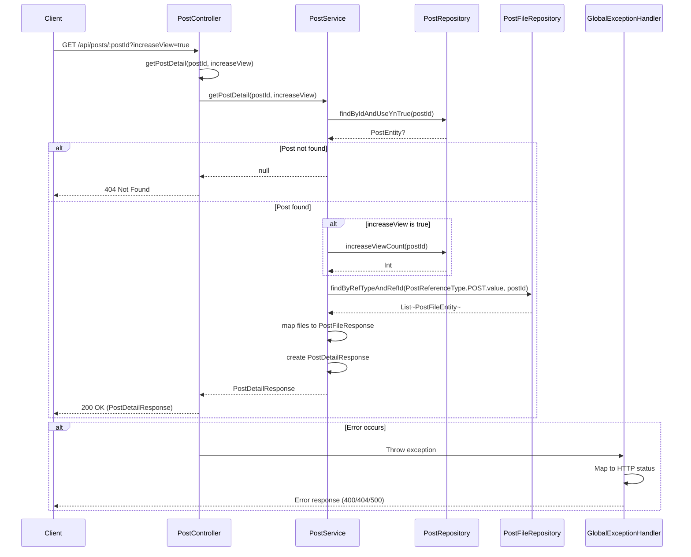

# PostController.getPostDetail - Sequence Diagram

```mermaid
sequenceDiagram
    participant Client
    participant PostController
    participant PostService
    participant PostRepository
    participant PostFileRepository
    participant GlobalExceptionHandler
    
    Client->>PostController: GET /api/posts/:postId?increaseView=true
    
    PostController->>PostController: getPostDetail(postId, increaseView)
    PostController->>PostService: getPostDetail(postId, increaseView)
    
    PostService->>PostRepository: findByIdAndUseYnTrue(postId)
    PostRepository-->>PostService: PostEntity?
    
    alt Post not found
        PostService-->>PostController: null
        PostController-->>Client: 404 Not Found
    else Post found
        alt increaseView is true
            PostService->>PostRepository: increaseViewCount(postId)
            PostRepository-->>PostService: Int
        end
        
        PostService->>PostFileRepository: findByRefTypeAndRefId(PostReferenceType.POST.value, postId)
        PostFileRepository-->>PostService: List~PostFileEntity~
        
        PostService->>PostService: map files to PostFileResponse
        PostService->>PostService: create PostDetailResponse
        PostService-->>PostController: PostDetailResponse
        
        PostController-->>Client: 200 OK (PostDetailResponse)
    end
    
    alt Error occurs
        PostController->>GlobalExceptionHandler: Throw exception
        GlobalExceptionHandler->>GlobalExceptionHandler: Map to HTTP status
        GlobalExceptionHandler-->>Client: Error response (400/404/500)
    end
```

