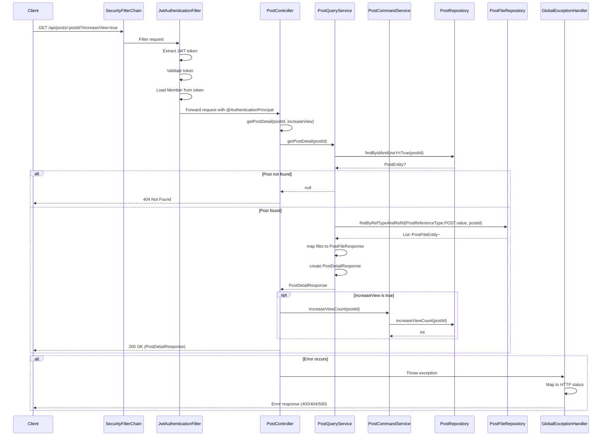

# PostController.getPostDetail - Sequence Diagram

```mermaid
sequenceDiagram
    participant Client
    participant SecurityFilterChain
    participant JwtAuthenticationFilter
    participant PostController
    participant PostQueryService
    participant PostCommandService
    participant PostRepository
    participant PostFileRepository
    participant GlobalExceptionHandler
    
    Client->>SecurityFilterChain: GET /api/posts/:postId?increaseView=true
    SecurityFilterChain->>JwtAuthenticationFilter: Filter request
    JwtAuthenticationFilter->>JwtAuthenticationFilter: Extract JWT token
    JwtAuthenticationFilter->>JwtAuthenticationFilter: Validate token
    JwtAuthenticationFilter->>JwtAuthenticationFilter: Load Member from token
    JwtAuthenticationFilter->>PostController: Forward request with @AuthenticationPrincipal
    
    PostController->>PostController: getPostDetail(postId, increaseView)
    PostController->>PostQueryService: getPostDetail(postId)
    
    PostQueryService->>PostRepository: findByIdAndUseYnTrue(postId)
    PostRepository-->>PostQueryService: PostEntity?
    
    alt Post not found
        PostQueryService-->>PostController: null
        PostController-->>Client: 404 Not Found
    else Post found
        PostQueryService->>PostFileRepository: findByRefTypeAndRefId(PostReferenceType.POST.value, postId)
        PostFileRepository-->>PostQueryService: List~PostFileEntity~
        
        PostQueryService->>PostQueryService: map files to PostFileResponse
        PostQueryService->>PostQueryService: create PostDetailResponse
        PostQueryService-->>PostController: PostDetailResponse
        
        opt increaseView is true
            PostController->>PostCommandService: increaseViewCount(postId)
            PostCommandService->>PostRepository: increaseViewCount(postId)
            PostRepository-->>PostCommandService: Int
        end
        
        PostController-->>Client: 200 OK (PostDetailResponse)
    end
    
    alt Error occurs
        PostController->>GlobalExceptionHandler: Throw exception
        GlobalExceptionHandler->>GlobalExceptionHandler: Map to HTTP status
        GlobalExceptionHandler-->>Client: Error response (400/404/500)
    end
```

