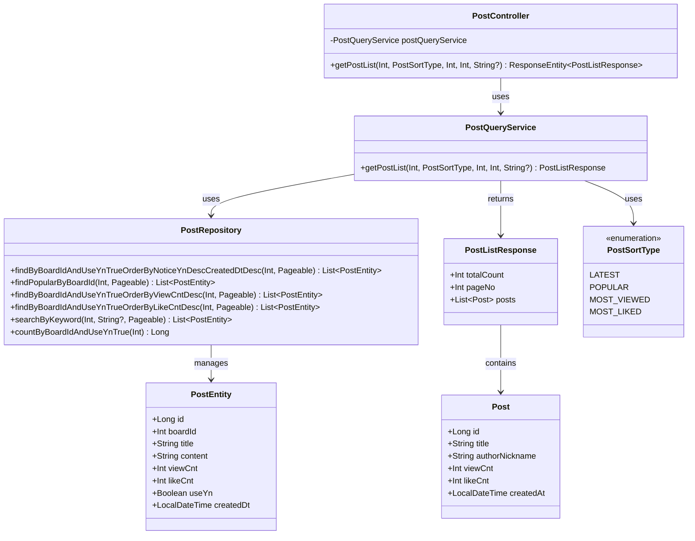

# PostController.getPostList - Class Diagram

```mermaid
classDiagram
    class PostController {
        -PostQueryService postQueryService
        +getPostList(Int, PostSortType, Int, Int, String?) ResponseEntity~PostListResponse~
    }
    
    class PostQueryService {
        +getPostList(Int, PostSortType, Int, Int, String?) PostListResponse
    }
    
    class PostRepository {
        +findByBoardIdAndUseYnTrueOrderByNoticeYnDescCreatedDtDesc(Int, Pageable) List~PostEntity~
        +findPopularByBoardId(Int, Pageable) List~PostEntity~
        +findByBoardIdAndUseYnTrueOrderByViewCntDesc(Int, Pageable) List~PostEntity~
        +findByBoardIdAndUseYnTrueOrderByLikeCntDesc(Int, Pageable) List~PostEntity~
        +searchByKeyword(Int, String?, Pageable) List~PostEntity~
        +countByBoardIdAndUseYnTrue(Int) Long
    }
    
    class PostEntity {
        +Long id
        +Int boardId
        +String title
        +String content
        +Int viewCnt
        +Int likeCnt
        +Boolean useYn
        +LocalDateTime createdDt
    }
    
    class PostListResponse {
        +Int totalCount
        +Int pageNo
        +List~Post~ posts
    }
    
    class Post {
        +Long id
        +String title
        +String authorNickname
        +Int viewCnt
        +Int likeCnt
        +LocalDateTime createdAt
    }
    
    class PostSortType {
        <<enumeration>>
        LATEST
        POPULAR
        MOST_VIEWED
        MOST_LIKED
    }
    
    PostController --> PostQueryService : uses
    PostQueryService --> PostRepository : uses
    PostRepository --> PostEntity : manages
    PostQueryService --> PostListResponse : returns
    PostListResponse --> Post : contains
    PostQueryService --> PostSortType : uses
```

