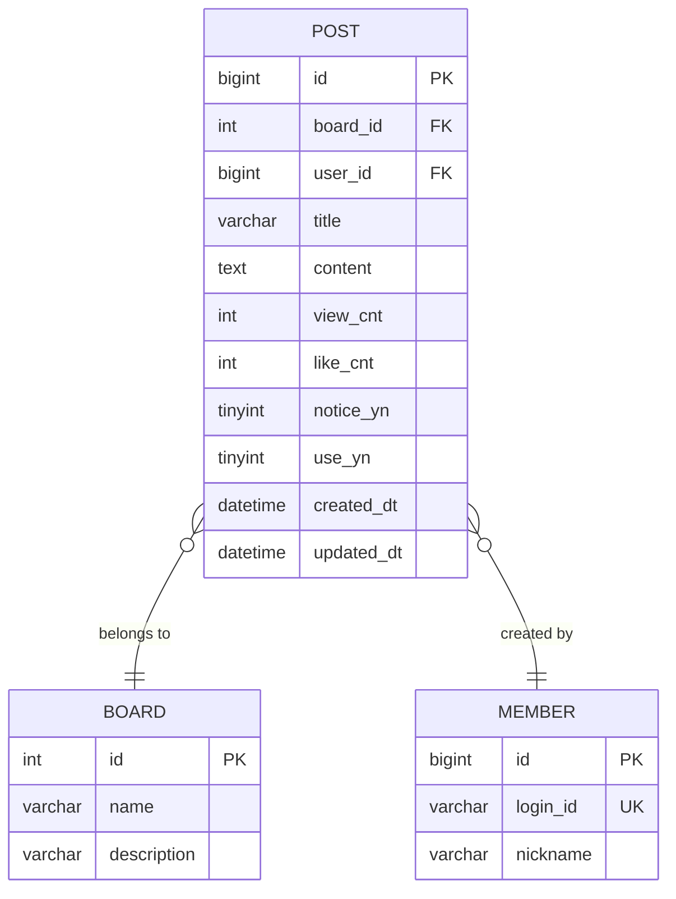

# PostController.getPostList - Database ERD

## Table Relationships

- **POST** → **BOARD**: Many-to-One (게시글은 하나의 게시판에 속함)
- **POST** → **MEMBER**: Many-to-One (게시글은 하나의 회원이 작성)

## Sorting Options

- **LATEST**: 최신순 (notice_yn DESC, created_dt DESC)
- **POPULAR**: 인기순 ((like_cnt + view_cnt) DESC, created_dt DESC)
- **MOST_VIEWED**: 조회수순 (notice_yn DESC, view_cnt DESC, created_dt DESC)
- **MOST_LIKED**: 좋아요순 (notice_yn DESC, like_cnt DESC, created_dt DESC)

