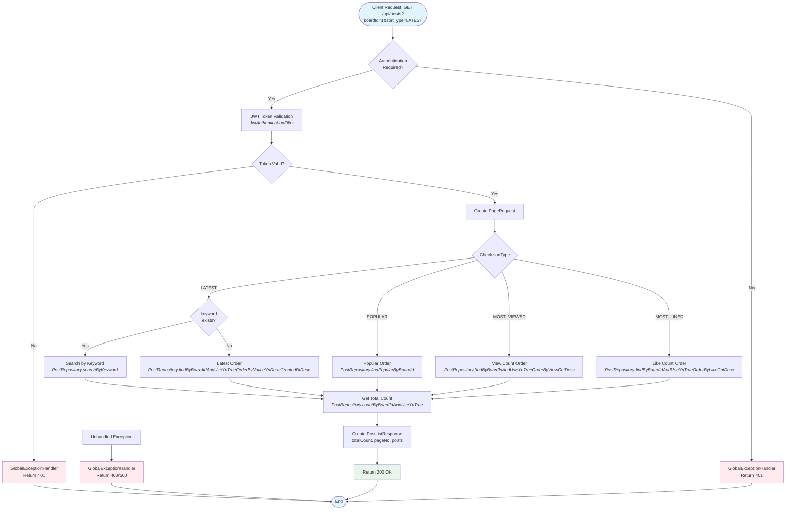

# PostController.getPostList - Flowchart

```mermaid
flowchart TD
    Start([Client Request: GET /api/posts?boardId=1&sortType=LATEST]) --> AuthCheck{Authentication<br/>Required?}
    AuthCheck -->|Yes| JWTValidate[JWT Token Validation<br/><i>JwtAuthenticationFilter</i>]
    AuthCheck -->|No| GlobalExceptionHandler1[GlobalExceptionHandler<br/>Return 401]
    
    JWTValidate --> TokenValid{Token Valid?}
    TokenValid -->|No| GlobalExceptionHandler2[GlobalExceptionHandler<br/>Return 401]
    TokenValid -->|Yes| CreatePageable[Create PageRequest]
    
    CreatePageable --> CheckSortType{Check sortType}
    
    CheckSortType -->|LATEST| CheckKeyword{keyword<br/>exists?}
    CheckKeyword -->|Yes| SearchKeyword[Search by Keyword<br/><i>PostRepository.searchByKeyword</i>]
    CheckKeyword -->|No| LatestOrder[Latest Order<br/><i>PostRepository.findByBoardIdAndUseYnTrueOrderByNoticeYnDescCreatedDtDesc</i>]
    
    CheckSortType -->|POPULAR| PopularOrder[Popular Order<br/><i>PostRepository.findPopularByBoardId</i>]
    
    CheckSortType -->|MOST_VIEWED| ViewCntOrder[View Count Order<br/><i>PostRepository.findByBoardIdAndUseYnTrueOrderByViewCntDesc</i>]
    
    CheckSortType -->|MOST_LIKED| LikeCntOrder[Like Count Order<br/><i>PostRepository.findByBoardIdAndUseYnTrueOrderByLikeCntDesc</i>]
    
    SearchKeyword --> GetCount[Get Total Count<br/><i>PostRepository.countByBoardIdAndUseYnTrue</i>]
    LatestOrder --> GetCount
    PopularOrder --> GetCount
    ViewCntOrder --> GetCount
    LikeCntOrder --> GetCount
    
    GetCount --> CreateResponse[Create PostListResponse<br/>totalCount, pageNo, posts]
    CreateResponse --> Return200[Return 200 OK]
    
    Return200 --> End([End])
    GlobalExceptionHandler1 --> End
    GlobalExceptionHandler2 --> End
    
    ErrorPath[Unhandled Exception] --> GlobalExceptionHandler3[GlobalExceptionHandler<br/>Return 400/500]
    GlobalExceptionHandler3 --> End
    
    style Start fill:#e1f5ff
    style End fill:#e1f5ff
    style Return200 fill:#e8f5e9
    style GlobalExceptionHandler1 fill:#ffebee
    style GlobalExceptionHandler2 fill:#ffebee
    style GlobalExceptionHandler3 fill:#ffebee
```

