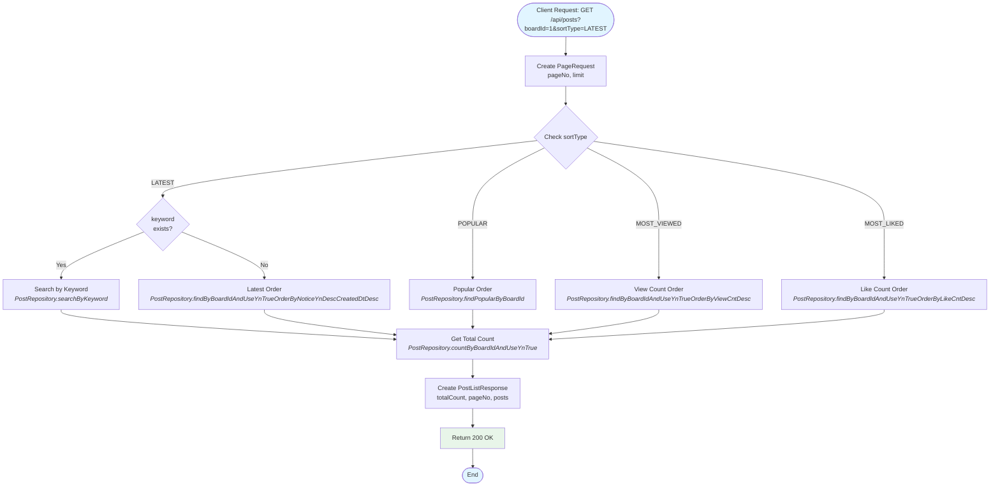

# PostController.getPostList - Flowchart

```mermaid
flowchart TD
    Start([Client Request: GET /api/posts?boardId=1&sortType=LATEST]) --> CreatePageable[Create PageRequest<br/>pageNo, limit]
    
    CreatePageable --> CheckSortType{Check sortType}
    
    CheckSortType -->|LATEST| CheckKeyword{keyword<br/>exists?}
    CheckKeyword -->|Yes| SearchKeyword[Search by Keyword<br/><i>PostRepository.searchByKeyword</i>]
    CheckKeyword -->|No| LatestOrder[Latest Order<br/><i>PostRepository.findByBoardIdAndUseYnTrueOrderByNoticeYnDescCreatedDtDesc</i>]
    
    CheckSortType -->|POPULAR| PopularOrder[Popular Order<br/><i>PostRepository.findPopularByBoardId</i>]
    
    CheckSortType -->|MOST_VIEWED| ViewCntOrder[View Count Order<br/><i>PostRepository.findByBoardIdAndUseYnTrueOrderByViewCntDesc</i>]
    
    CheckSortType -->|MOST_LIKED| LikeCntOrder[Like Count Order<br/><i>PostRepository.findByBoardIdAndUseYnTrueOrderByLikeCntDesc</i>]
    
    SearchKeyword --> GetCount[Get Total Count<br/><i>PostRepository.countByBoardIdAndUseYnTrue</i>]
    LatestOrder --> GetCount
    PopularOrder --> GetCount
    ViewCntOrder --> GetCount
    LikeCntOrder --> GetCount
    
    GetCount --> CreateResponse[Create PostListResponse<br/>totalCount, pageNo, posts]
    CreateResponse --> Return200[Return 200 OK]
    
    Return200 --> End([End])
    
    style Start fill:#e1f5ff
    style End fill:#e1f5ff
    style Return200 fill:#e8f5e9
```

