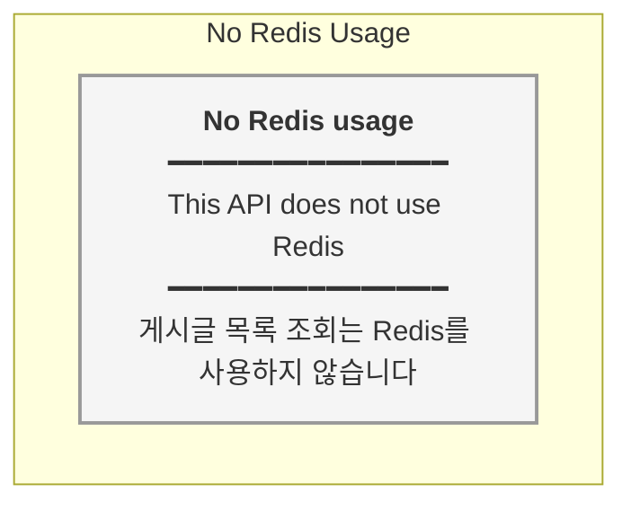

# PostController.getPostList - Redis Type Map

## Redis Usage Summary

| Key Pattern | Type | TTL | Description |
|------------|------|-----|-------------|
| N/A | - | - | 이 API는 Redis를 사용하지 않습니다 |

