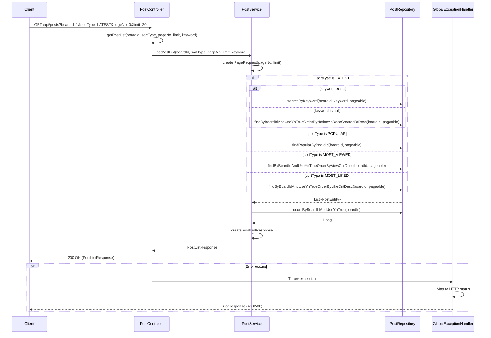

# PostController.getPostList - Sequence Diagram

```mermaid
sequenceDiagram
    participant Client
    participant PostController
    participant PostService
    participant PostRepository
    participant GlobalExceptionHandler
    
    Client->>PostController: GET /api/posts?boardId=1&sortType=LATEST&pageNo=0&limit=20
    
    PostController->>PostController: getPostList(boardId, sortType, pageNo, limit, keyword)
    PostController->>PostService: getPostList(boardId, sortType, pageNo, limit, keyword)
    
    PostService->>PostService: create PageRequest(pageNo, limit)
    
    alt sortType is LATEST
        alt keyword exists
            PostService->>PostRepository: searchByKeyword(boardId, keyword, pageable)
        else keyword is null
            PostService->>PostRepository: findByBoardIdAndUseYnTrueOrderByNoticeYnDescCreatedDtDesc(boardId, pageable)
        end
    else sortType is POPULAR
        PostService->>PostRepository: findPopularByBoardId(boardId, pageable)
    else sortType is MOST_VIEWED
        PostService->>PostRepository: findByBoardIdAndUseYnTrueOrderByViewCntDesc(boardId, pageable)
    else sortType is MOST_LIKED
        PostService->>PostRepository: findByBoardIdAndUseYnTrueOrderByLikeCntDesc(boardId, pageable)
    end
    
    PostRepository-->>PostService: List~PostEntity~
    
    PostService->>PostRepository: countByBoardIdAndUseYnTrue(boardId)
    PostRepository-->>PostService: Long
    
    PostService->>PostService: create PostListResponse
    PostService-->>PostController: PostListResponse
    
    PostController-->>Client: 200 OK (PostListResponse)
    
    alt Error occurs
        PostController->>GlobalExceptionHandler: Throw exception
        GlobalExceptionHandler->>GlobalExceptionHandler: Map to HTTP status
        GlobalExceptionHandler-->>Client: Error response (400/500)
    end
```

