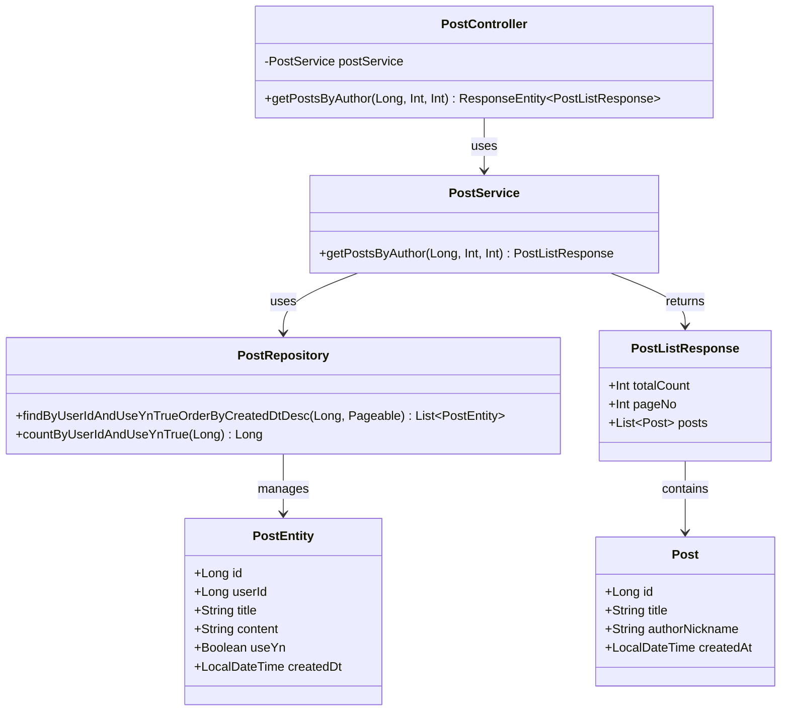

# PostController.getPostsByAuthor - Class Diagram

```mermaid
classDiagram
    class PostController {
        -PostService postService
        +getPostsByAuthor(Long, Int, Int) ResponseEntity~PostListResponse~
    }
    
    class PostService {
        +getPostsByAuthor(Long, Int, Int) PostListResponse
    }
    
    class PostRepository {
        +findByUserIdAndUseYnTrueOrderByCreatedDtDesc(Long, Pageable) List~PostEntity~
        +countByUserIdAndUseYnTrue(Long) Long
    }
    
    class PostEntity {
        +Long id
        +Long userId
        +String title
        +String content
        +Boolean useYn
        +LocalDateTime createdDt
    }
    
    class PostListResponse {
        +Int totalCount
        +Int pageNo
        +List~Post~ posts
    }
    
    class Post {
        +Long id
        +String title
        +String authorNickname
        +LocalDateTime createdAt
    }
    
    PostController --> PostService : uses
    PostService --> PostRepository : uses
    PostRepository --> PostEntity : manages
    PostService --> PostListResponse : returns
    PostListResponse --> Post : contains
```

