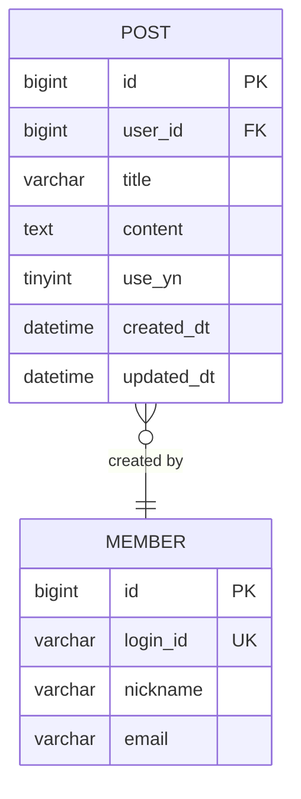

# PostController.getPostsByAuthor - Database ERD

```mermaid
erDiagram
    POST }o--|| MEMBER : "created by"
    
    POST {
        bigint id PK
        bigint user_id FK
        varchar title
        text content
        tinyint use_yn
        datetime created_dt
        datetime updated_dt
    }
    
    MEMBER {
        bigint id PK
        varchar login_id UK
        varchar nickname
        varchar email
    }
```

## Table Relationships

- **POST** → **MEMBER**: Many-to-One (게시글은 하나의 회원이 작성, user_id로 조회)

