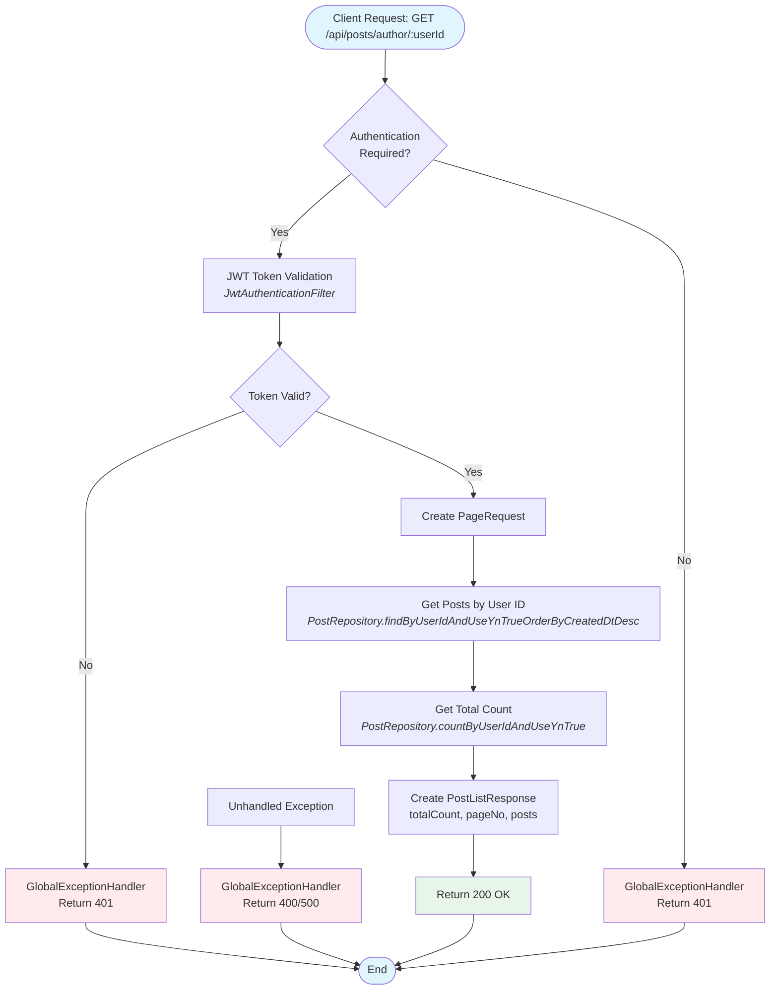

# PostController.getPostsByAuthor - Flowchart

```mermaid
flowchart TD
    Start([Client Request: GET /api/posts/author/:userId]) --> AuthCheck{Authentication<br/>Required?}
    AuthCheck -->|Yes| JWTValidate[JWT Token Validation<br/><i>JwtAuthenticationFilter</i>]
    AuthCheck -->|No| GlobalExceptionHandler1[GlobalExceptionHandler<br/>Return 401]
    
    JWTValidate --> TokenValid{Token Valid?}
    TokenValid -->|No| GlobalExceptionHandler2[GlobalExceptionHandler<br/>Return 401]
    TokenValid -->|Yes| CreatePageable[Create PageRequest]
    
    CreatePageable --> GetPosts[Get Posts by User ID<br/><i>PostRepository.findByUserIdAndUseYnTrueOrderByCreatedDtDesc</i>]
    
    GetPosts --> GetCount[Get Total Count<br/><i>PostRepository.countByUserIdAndUseYnTrue</i>]
    
    GetCount --> CreateResponse[Create PostListResponse<br/>totalCount, pageNo, posts]
    CreateResponse --> Return200[Return 200 OK]
    
    Return200 --> End([End])
    GlobalExceptionHandler1 --> End
    GlobalExceptionHandler2 --> End
    
    ErrorPath[Unhandled Exception] --> GlobalExceptionHandler3[GlobalExceptionHandler<br/>Return 400/500]
    GlobalExceptionHandler3 --> End
    
    style Start fill:#e1f5ff
    style End fill:#e1f5ff
    style Return200 fill:#e8f5e9
    style GlobalExceptionHandler1 fill:#ffebee
    style GlobalExceptionHandler2 fill:#ffebee
    style GlobalExceptionHandler3 fill:#ffebee
```

