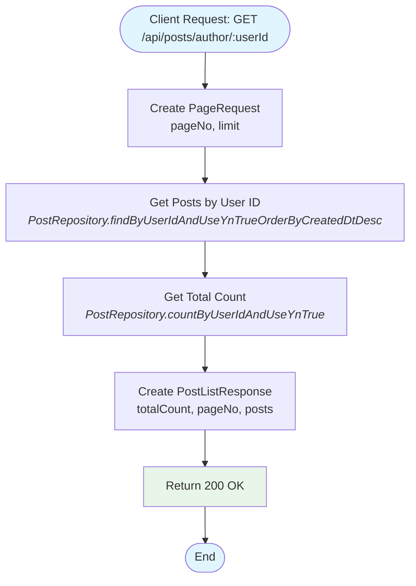

# PostController.getPostsByAuthor - Flowchart

```mermaid
flowchart TD
    Start([Client Request: GET /api/posts/author/:userId]) --> CreatePageable[Create PageRequest<br/>pageNo, limit]
    
    CreatePageable --> GetPosts[Get Posts by User ID<br/><i>PostRepository.findByUserIdAndUseYnTrueOrderByCreatedDtDesc</i>]
    
    GetPosts --> GetCount[Get Total Count<br/><i>PostRepository.countByUserIdAndUseYnTrue</i>]
    
    GetCount --> CreateResponse[Create PostListResponse<br/>totalCount, pageNo, posts]
    CreateResponse --> Return200[Return 200 OK]
    
    Return200 --> End([End])
    
    style Start fill:#e1f5ff
    style End fill:#e1f5ff
    style Return200 fill:#e8f5e9
```

