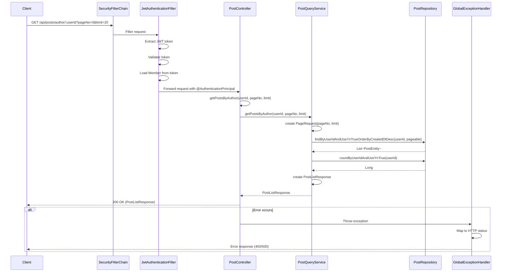

# PostController.getPostsByAuthor - Sequence Diagram

```mermaid
sequenceDiagram
    participant Client
    participant SecurityFilterChain
    participant JwtAuthenticationFilter
    participant PostController
    participant PostQueryService
    participant PostRepository
    participant GlobalExceptionHandler
    
    Client->>SecurityFilterChain: GET /api/posts/author/:userId?pageNo=0&limit=20
    SecurityFilterChain->>JwtAuthenticationFilter: Filter request
    JwtAuthenticationFilter->>JwtAuthenticationFilter: Extract JWT token
    JwtAuthenticationFilter->>JwtAuthenticationFilter: Validate token
    JwtAuthenticationFilter->>JwtAuthenticationFilter: Load Member from token
    JwtAuthenticationFilter->>PostController: Forward request with @AuthenticationPrincipal
    
    PostController->>PostController: getPostsByAuthor(userId, pageNo, limit)
    PostController->>PostQueryService: getPostsByAuthor(userId, pageNo, limit)
    
    PostQueryService->>PostQueryService: create PageRequest(pageNo, limit)
    
    PostQueryService->>PostRepository: findByUserIdAndUseYnTrueOrderByCreatedDtDesc(userId, pageable)
    PostRepository-->>PostQueryService: List~PostEntity~
    
    PostQueryService->>PostRepository: countByUserIdAndUseYnTrue(userId)
    PostRepository-->>PostQueryService: Long
    
    PostQueryService->>PostQueryService: create PostListResponse
    PostQueryService-->>PostController: PostListResponse
    
    PostController-->>Client: 200 OK (PostListResponse)
    
    alt Error occurs
        PostController->>GlobalExceptionHandler: Throw exception
        GlobalExceptionHandler->>GlobalExceptionHandler: Map to HTTP status
        GlobalExceptionHandler-->>Client: Error response (400/500)
    end
```

