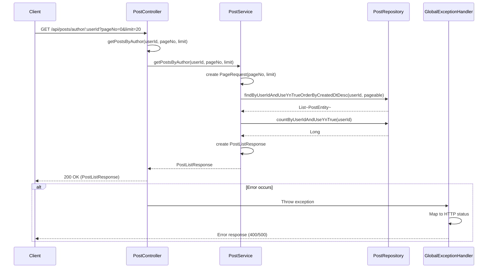

# PostController.getPostsByAuthor - Sequence Diagram

```mermaid
sequenceDiagram
    participant Client
    participant PostController
    participant PostService
    participant PostRepository
    participant GlobalExceptionHandler
    
    Client->>PostController: GET /api/posts/author/:userId?pageNo=0&limit=20
    
    PostController->>PostController: getPostsByAuthor(userId, pageNo, limit)
    PostController->>PostService: getPostsByAuthor(userId, pageNo, limit)
    
    PostService->>PostService: create PageRequest(pageNo, limit)
    
    PostService->>PostRepository: findByUserIdAndUseYnTrueOrderByCreatedDtDesc(userId, pageable)
    PostRepository-->>PostService: List~PostEntity~
    
    PostService->>PostRepository: countByUserIdAndUseYnTrue(userId)
    PostRepository-->>PostService: Long
    
    PostService->>PostService: create PostListResponse
    PostService-->>PostController: PostListResponse
    
    PostController-->>Client: 200 OK (PostListResponse)
    
    alt Error occurs
        PostController->>GlobalExceptionHandler: Throw exception
        GlobalExceptionHandler->>GlobalExceptionHandler: Map to HTTP status
        GlobalExceptionHandler-->>Client: Error response (400/500)
    end
```

